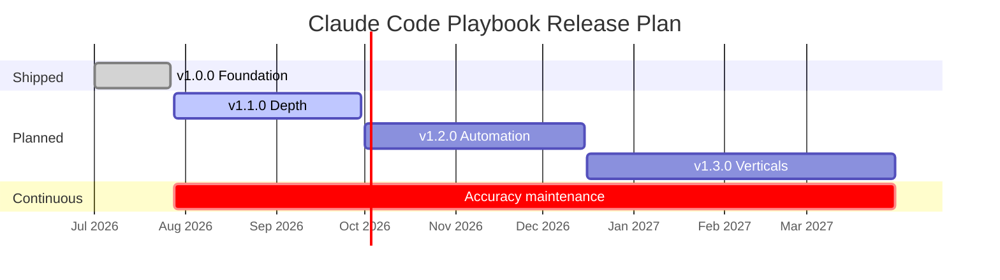
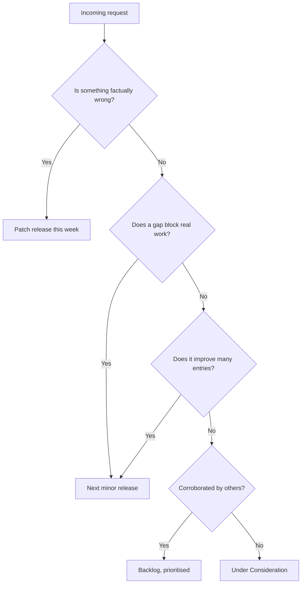

# Roadmap

This document describes what is planned, what is deliberately out of scope, and how priorities are decided. It is updated at each minor release.

Dates are targets, not commitments. Scope is cut before quality.

## Table of Contents

- [Guiding Principles](#guiding-principles)
- [Release Timeline](#release-timeline)
- [v1.0.0 — Foundation](#v100--foundation-shipped)
- [v1.1.0 — Depth](#v110--depth)
- [v1.2.0 — Automation](#v120--automation)
- [v1.3.0 — Verticals](#v130--verticals)
- [Under Consideration](#under-consideration)
- [Explicitly Out of Scope](#explicitly-out-of-scope)
- [How Priorities Are Decided](#how-priorities-are-decided)
- [Maintenance Commitments](#maintenance-commitments)
- [Related](#related)

---

## Guiding Principles

The roadmap is constrained by four commitments that override any feature request.

| Commitment | Consequence |
| --- | --- |
| **Depth over breadth** | We would rather ship forty entries people trust than four hundred people skim. Entry count is not a success metric. |
| **Every entry earns its place** | Adding an entry adds maintenance cost forever. Coverage gaps are cheaper than dead weight. |
| **Structure is stable** | Deep links are treated as a public API. Reorganisation happens at major versions only. |
| **Accuracy is not deferrable** | A factual correction ships ahead of any feature, in a patch release, the week it is reported. |

## Release Timeline

## v1.0.0 — Foundation (shipped)

Released 2026-07-27. Establishes the structure, standards, and first complete set of entries.

| Area | Delivered |
| --- | --- |
| Repository foundation | Licence, contribution standard, code of conduct, changelog policy, issue and PR templates |
| `docs/` | Ten orientation documents covering installation, prompting, research, thinking, workflow, output standards, style, and FAQ |
| `prompts/` | Domain-grouped structure with the flat A–Z index |
| `templates/` | Canonical entry template plus document and configuration skeletons |
| `frameworks/` | Reusable mental models for research, planning, shipping, and review |
| `checklists/` | Pre-flight and pre-ship verification lists |
| `snippets/` | Reusable prompt fragments and `CLAUDE.md` blocks |
| `examples/` | Worked runs demonstrating the entry structure end to end |

## v1.1.0 — Depth

**Theme: make the existing folders complete before opening new ones.**

Target: Q3 2026.

| Item | Rationale | Status |
| --- | --- | --- |
| **`core/planning/feature-implementation`** | The most common Claude Code task has no dedicated entry. Currently covered by inference from the senior-engineer role and the workflow chain | **Planned — first** |
| **Replace constructed examples with real runs** | Every 1.0.0 example is `Provenance: constructed`. Real runs rank above them and are the most wanted contribution | **Planned — first** |
| Complete every folder to a minimum of four entries | Folders with one entry signal an unfinished taxonomy | Planned |
| Adversarial review entries for each `quality/` topic | Self-review finds far less than a prompt explicitly told to attack the work | Planned |
| Worked examples for the ten most-used entries | The Example section is where entries most often go thin | Planned |
| Failure library in `examples/failures/` | Documented bad output is more instructive than good output | Planned |
| Model-selection guidance per entry | Not every task justifies maximum reasoning effort | Planned |
| Link checker in CI | Broken relative links are the most common decay mode in a cross-referenced repo | **Shipped in 1.0.0** |
| Structure validator in CI | A documented standard that nothing checks drifts within a release | **Shipped in 1.0.0** |

## v1.2.0 — Automation

**Theme: turn entries into things Claude Code can invoke, not just things humans paste.**

Target: Q4 2026.

| Item | Rationale | Status |
| --- | --- | --- |
| Slash-command definitions for high-frequency entries | Copy-paste is friction; a command is not | Planned |
| Reference `CLAUDE.md` files per project archetype | Project memory is the highest-leverage configuration surface | Planned |
| Hook recipes for verification gates | Enforcing a checklist beats documenting one | Planned |
| Subagent role definitions | Multi-agent review benefits from stable, named roles | Planned |
| Chained workflow definitions | Research → plan → build → review as a single declared pipeline | Planned |

> [!NOTE]
> Automation artefacts will be additive. Every entry remains usable as plain copy-paste Markdown; nothing in v1.2.0 makes tooling a prerequisite.

## v1.3.0 — Verticals

**Theme: industry-specific adaptation, where regulation and domain language change the work.**

Target: Q1 2027.

| Vertical | Why it needs its own treatment |
| --- | --- |
| Healthcare | Patient data handling, consent language, clinical accuracy claims |
| Finance and fintech | Regulatory disclosure, audit trails, numerical precision requirements |
| Education | Accessibility obligations, age-appropriate content, institutional procurement |
| Government and public sector | Statutory accessibility conformance, plain-language mandates, records retention |
| Legal | Citation discipline, jurisdiction sensitivity, privilege boundaries |
| E-commerce and retail | Conversion measurement, catalogue scale, payment compliance |
| Manufacturing and logistics | Operational data modelling, integration with legacy systems |
| Non-profit and NGO | Donor reporting, impact measurement, constrained budgets |

Each vertical entry adapts existing entries rather than duplicating them — the base workflow stays in its owning folder.

## Under Consideration

Not committed. Feedback on these is welcome via issues.

| Idea | Open question |
| --- | --- |
| Translations | Can translated entries be kept accurate as source entries change? Stale translations are worse than none. |
| Searchable web index | Does it justify the maintenance cost over GitHub's own search? |
| Benchmark suite comparing entry variants | Can we define a measurement method rigorous enough to publish? |
| Video walkthroughs | High production cost, ages fast, hard to correct |
| Community entry gallery | Requires a curation process we do not yet have capacity for |

## Explicitly Out of Scope

Stating this saves everyone time.

| Out of scope | Reason |
| --- | --- |
| A prompt for every conceivable task | Breadth without depth is what this repository exists to avoid |
| Jailbreaks or guardrail circumvention | Not useful, not welcome |
| Reproducing Claude Code's official documentation | It is maintained upstream and would go stale here; we link to it |
| Provider comparisons | This is a Claude Code playbook, not a model bake-off |
| Executable application code as a deliverable | Entries teach the process; they are not a component library |
| Paid or gated content | The repository is MIT-licensed and stays that way |

## How Priorities Are Decided

Requests are ranked by the following, in order:

1. **Correctness.** Anything factually wrong is fixed first, regardless of effort.
2. **Blocking gaps.** A missing entry that stops real work outranks an improvement to an entry that already works.
3. **Reuse.** Work that improves many entries at once outranks work that improves one.
4. **Evidence of demand.** Issues with corroborating reports outrank single requests.
5. **Maintenance cost.** A contribution that will need constant updating must justify that cost.

## Maintenance Commitments

| Commitment | Target |
| --- | --- |
| Factual corrections acknowledged | Within 7 days of report |
| Factual corrections released | Within 14 days of report |
| Pull requests receive first review | Within 14 days |
| Broken links audited | Every minor release |
| Version-sensitive claims re-verified | Every minor release |
| Entries reviewed for staleness | Annually, or when the underlying tool changes materially |

Entries that go stale and cannot be verified are marked deprecated rather than silently left wrong. Deprecated entries stay in place for one minor release before removal, and removal is a major version bump.

## Related

- [CHANGELOG.md](CHANGELOG.md) — what has actually shipped
- [CONTRIBUTING.md](CONTRIBUTING.md) — how to propose and submit work
- [README.md](README.md) — repository overview

## References

- [Semantic Versioning 2.0.0](https://semver.org/)
- [Keep a Changelog 1.1.0](https://keepachangelog.com/en/1.1.0/)
- [Claude Code documentation](https://docs.claude.com/en/docs/claude-code)
