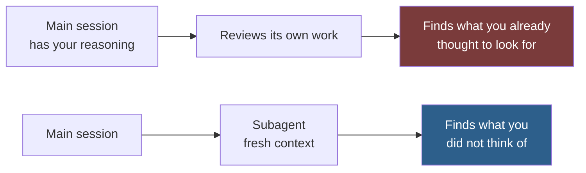

# Subagent Roles

Role definitions packaged as Claude Code subagents — bounded tasks delegated to a role with its own instructions, its own tool access, and **fresh context**.

> [!NOTE]
> **Status: planned for v1.2.** This folder has no definitions yet. Its scope and intended
> contents are documented below so the taxonomy is stable and links resolve.
> See [ROADMAP.md](../ROADMAP.md).

## What a Subagent Adds Over a Prompt

The roles in [prompts/core/system/](../prompts/core/system/) can be pasted into any session. Packaging one as a subagent adds exactly one thing, and it is the thing that matters for review work:

**Fresh context.** A subagent has not seen your reasoning, your false starts, or the argument you already made for the approach. It evaluates the artefact, not the story you told yourself while building it.

That is the whole argument. Use a subagent when contamination by your own reasoning is the problem you are trying to solve.

## When Not to Use One

| Situation | Why a subagent is the wrong tool |
| --- | --- |
| The task needs your accumulated context | It starts cold and re-derives what you already established, usually less well |
| You want the work done, not assessed | Fresh context is a cost here, not a benefit |
| The task is one step | The setup exceeds the task |
| You are delegating to avoid deciding | The reconciliation still lands on you |

## Planned Definitions

| Definition | Role | Primary use |
| --- | --- | --- |
| `research-agent.md` | Research analyst | Establishing facts without the main session's assumptions |
| `security-agent.md` | Security engineer | Adversarial review of code the main session wrote |
| `qa-agent.md` | Code reviewer | Defect finding with no knowledge of intent |
| `frontend-agent.md` | Senior engineer, browser-side | Component and state implementation |
| `backend-agent.md` | Senior engineer, server-side | Service and data implementation |
| `ui-agent.md` | UI designer | Visual and component design |
| `ux-agent.md` | UX designer | Flow, states, and task completion |
| `seo-agent.md` | Search analyst | Search visibility audit |
| `devops-agent.md` | Infrastructure engineer | Deployment and runtime review |
| `presentation-agent.md` | Narrative designer | Deck structure and argument |

Each will pair with its source role in [prompts/core/system/](../prompts/core/system/) rather than restating it, and will document the tool access it needs and why.

## The Rule That Governs This Folder

**Review agents report; they do not fix.**

An agent permitted to fix while reviewing produces a clean diff and no defect count. The count is the information — it tells you whether quality is improving, and a corrected file tells you nothing.

This constraint is why `qa-agent` and `security-agent` will ship with read-only tool access. It is not a limitation to work around; it is the point.

## Composition

Do not stack roles into one agent. Two roles in tension trade off silently, and the trade-off you cannot see is the one that ships.

Run them as separate passes and reconcile the results yourself — the conflict between a security finding and a usability finding is a decision that belongs to a person. See [role-composition.md](../prompts/core/system/role-composition.md#combining-roles).

## Where Definitions Live

Subagent definitions go in `.claude/agents/` in your own project, committed so the whole team gets them. The files here are reference definitions to copy and adapt, not a package to install.

See the [official subagents documentation](https://docs.claude.com/en/docs/claude-code/sub-agents) for the file format, which is upstream and not duplicated here.

## Contributing a Definition Here

Open an issue using the **New entry proposal** template. For this folder the proposal must answer:

1. Which role in [prompts/core/system/](../prompts/core/system/) does this package?
2. What does fresh context give you that pasting the role would not?
3. What tool access does it need, and what is the minimum?

A definition that only saves a paste is a snippet, and belongs in [snippets/](../snippets/).

## Related

- [prompts/core/system/](../prompts/core/system/) — the source roles these package
- [prompts/core/system/role-composition.md](../prompts/core/system/role-composition.md) — why roles run as separate passes
- [docs/AI-Agent-Workflow.md](../docs/AI-Agent-Workflow.md#delegating-to-subagents) — when delegation is worth it
- [prompts/mcp/](../prompts/mcp/) — servers that extend what an agent can reach
- [snippets/](../snippets/) — smaller reusable fragments
- [ROADMAP.md](../ROADMAP.md) — when this folder ships

## References

- [Claude Code subagents](https://docs.claude.com/en/docs/claude-code/sub-agents) — official documentation and file format
- [Claude Code documentation](https://docs.claude.com/en/docs/claude-code)
- [Claude Agent SDK](https://docs.claude.com/en/api/agent-sdk/overview) — building custom agent workflows
