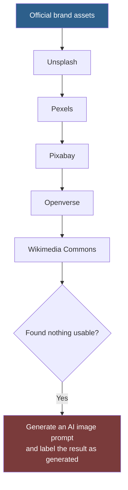

# Assets

Diagrams, and the image sourcing and licensing policy that applies across the repository.

## Image Sourcing Policy

This policy is repository-wide and binding. Every entry that calls for images defers to it rather than restating it.

### The sourcing order

Work down this list. Stop at the first source that has what you need with a licence you can actually comply with.

| Priority | Source | Use for | Watch for |
| --- | --- | --- | --- |
| 1 | **Official brand assets** | Any logo, product screenshot, or brand mark | Brand guidelines are usually restrictive about colour, spacing, and modification. Read them |
| 2 | [Unsplash](https://unsplash.com) | Photography | Licence permits commercial use; attribution appreciated, not required. Recognisable people and property still need releases |
| 3 | [Pexels](https://pexels.com) | Photography, video | Similar terms; check the current licence |
| 4 | [Pixabay](https://pixabay.com) | Photography, illustration, vectors | Check per-asset; terms have changed historically |
| 5 | [Openverse](https://openverse.org) | Openly licensed media | Licences vary **per asset**. Check each one individually |
| 6 | [Wikimedia Commons](https://commons.wikimedia.org) | Reference, historical, scientific | Often requires specific attribution, sometimes share-alike. Read the file page |
| 7 | AI generation | When nothing above works | Label as generated. Do not present as photography |

> [!WARNING]
> A licence permitting commercial use does not grant rights to the **people or property** depicted. Photographs of identifiable individuals, private property, or trademarked products carry separate rights that no stock licence conveys. For anything customer-facing, check for a model or property release.

### Rules that apply regardless of source

| Rule | Detail |
| --- | --- |
| **Record the provenance** | Source URL, licence, author, and date obtained. Store it with the asset, not in someone's memory |
| **Attribute where required** | Some licences require it. Non-compliance is a licence breach, not a courtesy failure |
| **Never hotlink** | It breaks, it costs someone else bandwidth, and it usually violates terms |
| **Never scrape search results** | Image search is not a source. The results carry the rights of their origin |
| **Optimise before use** | Modern format, correct dimensions, lazy-loaded below the fold. See [quality/performance/](../prompts/quality/performance/) |
| **Write real alt text** | Meaningful images describe their content and purpose; decorative images get `alt=""`. See [quality/accessibility/](../prompts/quality/accessibility/) |
| **Re-verify before republication** | Licences change. A licence that permitted use in 2024 may not today |

### When you generate instead

If nothing suitable exists, produce an AI image prompt rather than a poor substitute. Then:

- **Label it as generated** wherever the label matters — editorial, journalistic, or evidential contexts.
- **Never generate a real person's likeness**, a real brand's mark, or anything presented as documentation of a real event.
- **Do not present generated imagery as photography** of something that happened.
- **Check the generator's own terms** for commercial use and ownership.

## Diagrams

Diagrams in this repository are [Mermaid](https://mermaid.js.org/), written inline in Markdown. GitHub renders it natively, it diffs as text, and it needs no asset pipeline or licence.

Binary diagram files are avoided deliberately: they cannot be diffed, cannot be corrected by a contributor without the source tool, and go stale invisibly.

| Convention | Value |
| --- | --- |
| Emphasis / recommended path | `fill:#2d5f8b,color:#fff` |
| Failure / anti-pattern | `fill:#7a3b3b,color:#fff` |
| Maximum nodes | Around 12 — larger diagrams do not render legibly on mobile |
| Colour alone | Never carries meaning. The label must carry it |

Full rules: [docs/Style-Guide.md](../docs/Style-Guide.md#diagrams).

## Contents of This Folder

Currently policy only. Binary assets will be added here if a genuine need arises, with provenance recorded alongside each one.

## Related

- [../prompts/media/images/](../prompts/media/images/) — the image sourcing and generation workflows that apply this policy
- [../prompts/quality/accessibility/](../prompts/quality/accessibility/) — alt text requirements
- [../prompts/quality/performance/](../prompts/quality/performance/) — image optimisation
- [../docs/Style-Guide.md](../docs/Style-Guide.md#diagrams) — diagram conventions
- [../docs/Output-Standards.md](../docs/Output-Standards.md#content-standards) — attribution requirements

## References

- [Unsplash licence](https://unsplash.com/license)
- [Pexels licence](https://www.pexels.com/license/)
- [Pixabay content licence](https://pixabay.com/service/license-summary/)
- [Openverse](https://openverse.org/) — licence varies per asset
- [Wikimedia Commons licensing](https://commons.wikimedia.org/wiki/Commons:Licensing)
- [Creative Commons licence types](https://creativecommons.org/share-your-work/cclicenses/)
- [Mermaid documentation](https://mermaid.js.org/)
