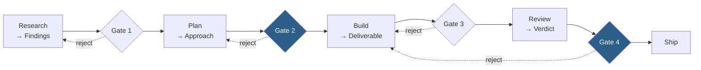
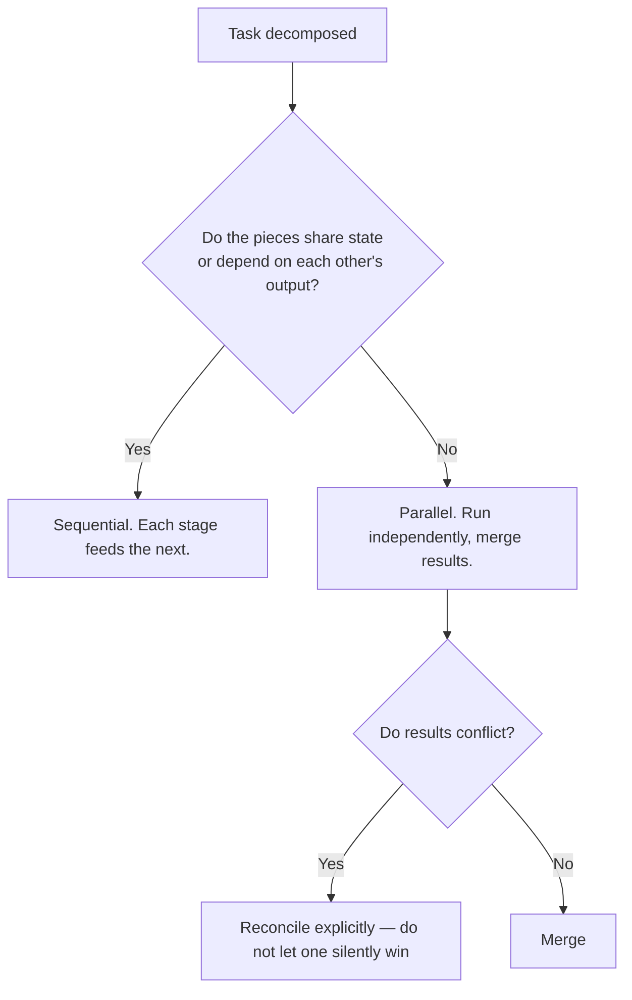
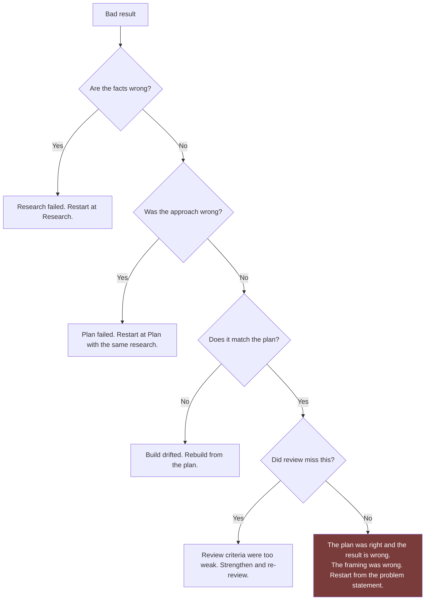

# AI Agent Workflow

How to stage work that is too large for one prompt, where to place human review gates, and how to turn repeated workflows into permanent tooling.

## Table of Contents

- [When One Prompt Is Not Enough](#when-one-prompt-is-not-enough)
- [The Standard Chain](#the-standard-chain)
- [Stage Contracts](#stage-contracts)
- [Human Review Gates](#human-review-gates)
- [Context Management Between Stages](#context-management-between-stages)
- [Parallel vs Sequential Work](#parallel-vs-sequential-work)
- [Delegating to Subagents](#delegating-to-subagents)
- [Turning Entries Into Commands](#turning-entries-into-commands)
- [Enforcing Gates With Hooks](#enforcing-gates-with-hooks)
- [Failure Recovery](#failure-recovery)
- [Common Mistakes](#common-mistakes)
- [Quick Reference](#quick-reference)
- [Related](#related)
- [References](#references)

---

## When One Prompt Is Not Enough

Adding words to a prompt has a ceiling. Past it, you need stages.

| Signal | What is happening | Response |
| --- | --- | --- |
| Output is strong at the start, weak at the end | The task exceeded what one pass sustains | Split it |
| An early decision silently determined everything after | No checkpoint existed to catch it | Insert a gate after the decision |
| You cannot verify the result without redoing the work | The output has no intermediate artefacts | Stage it so each step produces something checkable |
| Requirements from turn 2 were forgotten by turn 12 | Context drift | Consolidate and restart with a single prompt |
| Two independent problems are fighting for attention | You asked one question that was two | Separate them |

> [!IMPORTANT]
> The reason to stage is not size. It is **the presence of a decision that changes everything downstream.** A long mechanical task is fine in one pass. A short task containing one load-bearing choice is not.

## The Standard Chain

Four stages, each producing an artefact the next consumes.



| Stage | Produces | Fails when |
| --- | --- | --- |
| **Research** | Verified findings, conflicts, gaps, assumptions | Facts are unsourced or gaps were filled with guesses |
| **Plan** | Chosen approach, alternatives rejected with reasons, risks | Only one option was considered |
| **Build** | The deliverable | It drifted from the plan without saying so |
| **Review** | A verdict with specific findings | It is agreeable rather than adversarial |

The two highlighted gates are the ones that matter most. **Gate 2** is the cheapest place to change direction — redirecting a plan costs minutes, unwinding an implementation costs hours. **Gate 4** is the last point before consequences become real.

Not every task needs all four. Match the chain to the tier from [Thinking-Framework.md](Thinking-Framework.md#four-effort-tiers):

| Tier | Chain |
| --- | --- |
| T1 | Ask directly |
| T2 | Build → Review |
| T3 | Research → Plan → Build → Review |
| T4 | Research → Plan → Build → Review → Adversarial review → Human sign-off |

## Stage Contracts

Each stage needs a defined input and output, or the chain becomes a conversation with extra steps.

**Research stage contract:**

```text
INPUT   Topic, purpose, known constraints
OUTPUT  1. Findings, each with source link and confidence label
        2. Conflicts between sources, unresolved
        3. Gaps, and what would close them
        4. Assumptions table: #, Assumption, Risk, If wrong

Do not propose solutions. This stage establishes what is true, not
what to do about it.
```

The final line is what keeps the stage honest. A research stage that recommends is a planning stage that skipped the evidence step.

**Plan stage contract:**

```text
INPUT   Research findings, constraints, success criteria
OUTPUT  1. Options considered — minimum three, including "do nothing"
        2. Recommended option, with the reason it beat each alternative
        3. Implementation steps, each independently verifiable
        4. Risks, with mitigations
        5. What would make us abandon this approach

Do not write implementation code. If a step cannot be verified
independently, split it until it can.
```

**Build stage contract:**

```text
INPUT   The approved plan
OUTPUT  The deliverable, plus a deviations list

If you depart from the plan, state which step, why, and what it
affects. Silent deviation is the failure mode this stage has.
```

**Review stage contract:**

```text
INPUT   The deliverable, the plan, the acceptance criteria
OUTPUT  Per criterion: PASS / FAIL / UNVERIFIABLE, with evidence
        Plus: defects found, ordered by severity
        Plus: verdict — SHIP, FIX FIRST, or RECONSIDER APPROACH

Do not fix anything. Report only. Fixing while reviewing hides how
much was wrong.
```

## Human Review Gates

A gate is a point where a person decides whether to continue. Gates are cheap; discovering a bad assumption after implementation is not.

| Gate | Ask yourself | Reject if |
| --- | --- | --- |
| **After research** | Do I believe these findings? Are the gaps acceptable? | Key claims are unsourced, or a HIGH-risk assumption is unresolved |
| **After planning** | Would I have chosen this? Do I understand why not the others? | Alternatives were not genuinely considered, or a risk has no mitigation |
| **After build** | Does this match the plan? Are the deviations justified? | It quietly became a different solution |
| **After review** | Do I accept the verdict? | The review is agreeable, or findings lack evidence |

> [!WARNING]
> A gate you always pass is not a gate. If you have never rejected at Gate 2, you are not reading the plans — you are approving them. The value of a gate is entirely in its willingness to say no.

### Gate 2 is the important one

Effort spent reviewing a plan returns more than effort spent anywhere else in the chain, because it is the last point where changing direction is cheap.

Read the plan asking three questions:

1. **Is the problem framed correctly?** Everything downstream inherits this.
2. **Were the alternatives real?** Two strawmen and a favourite is not a comparison.
3. **What is the assumption this rests on?** Find it, and decide whether you believe it.

## Context Management Between Stages

Long chains accumulate irrelevant context, which degrades output quality. Two strategies:

| Strategy | How | Use when |
| --- | --- | --- |
| **Continuous** | Same session, stages run in sequence | Stages are tightly coupled and short |
| **Handoff** | Each stage writes an artefact to a file; next stage starts fresh and reads it | Stages are long, or the chain spans days |

Handoff is more work and more reliable. It produces a durable record, survives interruption, and prevents drift.

```text
docs/decisions/2026-07-27-refund-idempotency/
├── 1-research.md      # Findings, sources, gaps, assumptions
├── 2-plan.md          # Options, decision, risks
├── 3-review.md        # Verdict and findings
└── README.md          # One-paragraph summary and current status
```

> [!TIP]
> When output quality degrades mid-session, the cause is usually accumulated context rather than task difficulty. Write the current state to a file, start a fresh session, and read the file back in. This recovers more quality than any amount of rephrasing.

## Parallel vs Sequential Work

Not everything needs to be in a chain.



Genuinely parallel work is more common than people assume:

| Parallel-safe | Must be sequential |
| --- | --- |
| Auditing five independent modules | Schema design → migration → application code |
| Researching three vendors | Research → plan → build |
| Writing docs for unrelated features | Information architecture → page content |
| Reviewing a change for security, then separately for performance | Anything where step 2 needs step 1's decision |

The security/performance split is worth noting: reviewing one dimension at a time produces better findings than reviewing all dimensions at once, because a single pass optimises for breadth and misses depth.

## Delegating to Subagents

Claude Code supports subagents — bounded roles with their own instructions and tool access, defined in `.claude/agents/*.md`.

Use one when:

| Signal | Example |
| --- | --- |
| The task has a distinct role with different priorities | A security reviewer that assumes hostile input |
| You want an independent opinion, uncontaminated by the build context | A reviewer that has not seen your reasoning |
| The work is a broad search whose intermediate output you do not need | "Find every place we construct SQL by concatenation" |
| Several independent tasks can run at once | Auditing five modules |

Do not use one when the task needs your accumulated context — a subagent starts cold and will re-derive what you already know, usually less well.

Role definitions live in [agents/](../agents/).

## Turning Entries Into Commands

Once you run a playbook entry regularly, promote it. A slash command lives in `.claude/commands/<name>.md`; the file body becomes the prompt.

```markdown
---
description: Review the current diff against our security checklist
---

You are a security engineer reviewing a change for defects.
Assume all input is hostile. Prefer eliminating a bug class over
patching an instance.

Review the current diff. For each finding, produce:
| Severity | File:line | Defect | Trigger | Fix |

A finding without a concrete trigger goes in a separate
"Unverified concerns" list. Do not fix anything — report only.
```

Then `/security-review` runs it. Commit the file so the whole team gets it.

> [!TIP]
> The promotion threshold is **twice**. The second time you paste the same prompt, make it a command. The cost is two minutes; the alternative is rediscovering it every month.

## Enforcing Gates With Hooks

Documenting a gate is weaker than enforcing one. Hooks in `.claude/settings.json` run automatically at defined points — for example, running a linter after every file edit, or a check before a commit.

Use a hook when the rule is:

- **Mechanical** — a command decides pass/fail, not a judgement
- **Non-negotiable** — you never want it skipped
- **Fast** — slow hooks get disabled

Use documentation when the check needs judgement. A hook cannot decide whether an API design is good; it can decide whether the linter passed.

See the [official hooks documentation](https://docs.claude.com/en/docs/claude-code/hooks) for configuration.

## Failure Recovery

When a chain produces a bad result, find which stage failed rather than restarting everything.



The terminal case is worth dwelling on: when the research was sound, the plan was sound, the build matched the plan, review passed, and the result is still wrong — **you solved the wrong problem correctly.** No amount of restarting a later stage fixes that. Go back to the problem statement.

## Common Mistakes

| Mistake | Why it happens | Fix |
| --- | --- | --- |
| Staging by size rather than by decision | Large tasks feel like they need process | Stage where a decision changes what follows |
| Gates that always pass | Reviewing carefully is slower than approving | If Gate 2 has never rejected, you are not using it |
| Research stage that recommends | Recommending feels helpful | Enforce the contract: findings only |
| Build stage that silently deviates | Deviating felt obviously correct at the time | Require a deviations list |
| Review stage that fixes as it goes | Fixing feels efficient | Report first; fixing hides the defect count |
| Carrying full context through a long chain | It seems safer to keep everything | Hand off via files; fresh context outperforms accumulated context |
| Restarting the whole chain on failure | Unclear which stage broke | Use the recovery flow to isolate the stage |
| Parallelising work that shares state | Parallel feels faster | Shared state means sequential, or you get conflicting results |
| Never promoting a repeated prompt | Each individual paste feels cheap | Promote on the second use |

## Quick Reference

```text
STAGE WHEN
  □ An early decision determines everything downstream
  □ You cannot verify the result without redoing the work
  □ Output degrades toward the end of a single pass

THE CHAIN
  Research → [Gate] → Plan → [GATE] → Build → [Gate] → Review → [GATE] → Ship
                              ^^^^^^                            ^^^^^^
                    cheapest place to change direction     last chance

STAGE RULES
  Research  produces findings, never recommendations
  Plan      produces options, never code
  Build     produces the deliverable, plus a deviations list
  Review    produces a verdict, never fixes

CONTEXT
  Short coupled stages  → one session
  Long or multi-day     → file handoff, fresh session each stage
  Quality degrading     → write state to file, restart clean

PROMOTE
  Used a prompt twice?  → slash command
  Rule is mechanical?   → hook
  Needs judgement?      → keep it a documented gate
```

## Related

- [Thinking-Framework.md](Thinking-Framework.md) — choosing the tier that decides the chain
- [Prompting-Guide.md](Prompting-Guide.md) — writing each stage's prompt
- [Research-Framework.md](Research-Framework.md) — the research stage contract in full
- [Output-Standards.md](Output-Standards.md) — what the review stage checks against
- [agents/](../agents/) — subagent role definitions
- [prompts/core/planning/](../prompts/core/planning/) — planning entries

## References

- [Claude Code documentation](https://docs.claude.com/en/docs/claude-code)
- [Claude Code hooks](https://docs.claude.com/en/docs/claude-code/hooks) — automated gate enforcement
- [Claude Code subagents](https://docs.claude.com/en/docs/claude-code/sub-agents) — delegating bounded tasks
- [Claude Code slash commands](https://docs.claude.com/en/docs/claude-code/slash-commands) — promoting prompts to commands
- [Claude Agent SDK](https://docs.claude.com/en/api/agent-sdk/overview) — building custom agent workflows
