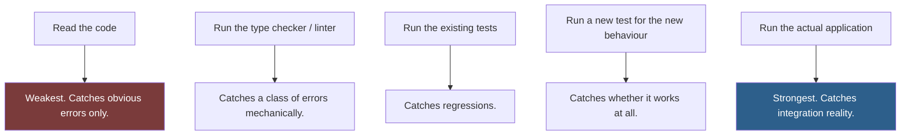

# Claude Code Best Practices

Working habits for people using Claude Code daily. Less about prompting technique, more about how to structure your sessions, your repository, and your team's expectations.

## Table of Contents

- [The Highest-Leverage Practices](#the-highest-leverage-practices)
- [Session Hygiene](#session-hygiene)
- [Working in a Codebase](#working-in-a-codebase)
- [Verification Discipline](#verification-discipline)
- [Permissions and Safety](#permissions-and-safety)
- [Working With Git](#working-with-git)
- [Reviewing AI-Assisted Changes](#reviewing-ai-assisted-changes)
- [Managing Context](#managing-context)
- [Cost and Effort Awareness](#cost-and-effort-awareness)
- [Team Practices](#team-practices)
- [Anti-Patterns](#anti-patterns)
- [Daily Checklist](#daily-checklist)
- [Related](#related)
- [References](#references)

---

## The Highest-Leverage Practices

If you adopt only five things from this document, adopt these.

| # | Practice | Why it ranks here |
| --- | --- | --- |
| 1 | **Maintain a real `CLAUDE.md`** | Every session inherits it. One line prevents a mistake forever. |
| 2 | **Ask for a plan before non-trivial changes** | Redirecting a plan costs minutes; unwinding an implementation costs hours. |
| 3 | **Define "done" before starting** | Without it you accept the first plausible result. |
| 4 | **Verify by running things, not by reading them** | Code that looks right and fails is the default failure mode. |
| 5 | **Start a fresh session when quality degrades** | Accumulated context degrades output more than task difficulty does. |

Everything below elaborates on these.

## Session Hygiene

### Start with intent

Open a session knowing what you want out of it. A session with a goal ends; a session without one drifts until you get frustrated and close it.

| Good session opener | Why |
| --- | --- |
| "Add rate limiting to the public API endpoints. Plan first." | Bounded, states the deliverable, requests a gate |
| "Find every place we build SQL by string concatenation." | Bounded search with a clear stop condition |
| "Review the current diff for security defects. Report only, do not fix." | Clear role, clear scope, clear non-goal |

| Poor opener | Why |
| --- | --- |
| "Let's improve the codebase" | No definition of improved, no stop condition |
| "Look at this and tell me what you think" | Invites unfocused commentary |
| "Fix the bugs" | Which bugs? Found how? Verified how? |

### One session, one concern

Switching topics mid-session mixes context. The security review you asked for at turn 3 is still colouring the UI work at turn 20. When the topic changes materially, start a new session.

### End with a durable artefact

A session that ends with knowledge only in the transcript has produced nothing lasting. Before closing, ask: did this produce a commit, a document, or a `CLAUDE.md` line? If not, the next person — including you next month — starts from zero.

## Working in a Codebase

| Practice | Detail |
| --- | --- |
| **Point at files, do not describe them** | "Follow the pattern in `app/Domain/Billing/`" cannot drift from reality; a paragraph describing it can |
| **Name the exemplar** | "Match `UserRepository.php`" gives a concrete target and a consistent result |
| **Scope the search** | On a large repository, say where to look. Unscoped exploration burns context and returns worse answers |
| **Prefer small diffs** | A 40-line change gets reviewed; a 900-line change gets skimmed and approved |
| **Ask for the plan on anything structural** | Refactors, new modules, schema changes, dependency additions |
| **State the verification command** | Put it in `CLAUDE.md` once rather than repeating it every session |
| **Say what not to touch** | "Do not modify migrations before 2024-06" prevents a class of accident |

> [!TIP]
> When you find yourself explaining the same context twice, that context belongs in `CLAUDE.md`. The reflex to develop: notice the repetition, stop, add the line, continue. See [Installation.md](Installation.md#writing-a-claudemd-that-earns-its-place).

## Verification Discipline

This is where most teams are weakest, and where the cost lands.

**Reading code is not verification.** Code that looks correct and is not is the normal case — that is what makes bugs bugs. The verification hierarchy:



| Rule | Detail |
| --- | --- |
| **Never claim done without running something** | "This should work" is a hypothesis |
| **Show the output, do not summarise it** | "Tests pass" is a claim; the test output is evidence |
| **New behaviour needs a new test** | Existing tests cannot cover behaviour that did not exist |
| **A failing test is information, not an obstacle** | Do not weaken a test to make it pass |
| **Report failures plainly** | If three of forty tests fail, say so with the output |

> [!WARNING]
> Watch for tests modified in the same change as the code they test. Sometimes legitimate, often a test bent to accommodate a defect. Review those diffs specifically.

## Permissions and Safety

| Rule | Reason |
| --- | --- |
| Allowlist read-only commands freely | `git status`, `git diff`, `ls`, test runs — no downside, removes friction |
| Never allowlist a broad wildcard | `Bash(*)` defeats the entire mechanism |
| Be deliberate about anything that writes | Deploys, migrations, package installs, file deletion |
| Deny-list the genuinely dangerous | `rm -rf`, force pushes, production credentials |
| Review the allowlist as a team | It is a shared safety configuration, not a personal preference |
| Re-read it quarterly | Allowlists accumulate; nobody removes entries |

### Actions that always deserve a pause

Regardless of allowlist, stop and confirm before:

- Deleting data, files, or branches
- Force-pushing or rewriting history
- Deploying, or anything touching production
- Sending anything outward — email, API calls to third parties, publishing
- Installing dependencies
- Modifying credentials, keys, or auth configuration

The common property: **you cannot inspect the result and undo it.** See [Thinking-Framework.md](Thinking-Framework.md#the-reversibility-test).

## Working With Git

| Practice | Detail |
| --- | --- |
| **Commit before large changes** | A clean checkpoint makes any mistake recoverable with one command |
| **Never work directly on `main`** | Branch first, always |
| **Small, logical commits** | One concern per commit; it makes review and revert both possible |
| **Write real commit messages** | Explain why, not what — the diff already shows what |
| **Review the diff before committing** | Every time. This is the last cheap moment to catch problems |
| **Do not skip hooks** | If a pre-commit hook fails, fix the cause. `--no-verify` moves the problem, it does not solve it |

A useful pattern for exploratory work:

```bash
git checkout -b experiment/refactor-billing
# ... work ...
git diff main          # Review the full change before deciding anything
```

If the experiment fails, delete the branch. The cost of a wrong direction becomes zero, which makes it safe to try more directions.

## Reviewing AI-Assisted Changes

**The review bar does not change based on who wrote the code.** But the *failure modes* differ, so where you look changes.

| Look for | Why it is more common here |
| --- | --- |
| **Plausible but wrong API usage** | Fabricated method signatures read naturally |
| **Silent scope expansion** | Adjacent improvements creep in unrequested |
| **Over-abstraction** | Patterns applied because they are patterns, not because they are needed |
| **Tests that assert the implementation** | Restating what the code does rather than what it should do |
| **Removed edge-case handling** | Simplification that discarded a case someone added deliberately |
| **Inconsistent with local conventions** | Correct in general, wrong for this codebase |
| **Confident comments that are wrong** | Comments describing intent the code does not have |

> [!IMPORTANT]
> The genuinely dangerous output is not the obviously bad kind — that gets caught. It is work that is 95% right, well-structured, well-commented, and wrong in one specific place that everyone's eyes slide over because the surrounding code inspires confidence.

## Managing Context

Context is finite, and its quality degrades as it fills with material that is no longer relevant.

| Symptom | Cause | Fix |
| --- | --- | --- |
| Forgetting constraints stated earlier | Drift over a long session | Restate them, or start fresh |
| Output quality dropping mid-session | Accumulated irrelevant context | Write state to a file, start a new session, read it back |
| Repeating a suggestion already rejected | The rejection is buried | State rejected options explicitly in the new prompt |
| Slow responses on a large repository | Reading more than needed | Scope requests to paths; keep build output out of the repo |

**The file handoff pattern** is the reliable answer to all of these:

```text
1. "Summarise the current state, decisions made, and remaining work.
    Write it to docs/wip/refund-idempotency.md."
2. Start a fresh session.
3. "Read docs/wip/refund-idempotency.md and continue from there."
```

This costs one round trip and consistently recovers more quality than any amount of rephrasing.

## Cost and Effort Awareness

Whether you pay per token or by subscription, effort is a real budget.

| Practice | Effect |
| --- | --- |
| Scope requests to specific paths | Less context read, faster and better answers |
| Do not paste files that are already in the repository | Point at them instead |
| Use the Advanced Version only when stakes justify it | It costs more attention for no gain on routine work |
| Keep generated output and dependencies out of the repository | They dilute every search |
| Start fresh sessions rather than fighting a degraded one | Cheaper than repeated correction rounds |

> [!NOTE]
> The largest waste is not tokens — it is round trips caused by an underspecified first request. Ten minutes framing a task properly regularly saves an hour of correction.

## Team Practices

| Practice | Detail |
| --- | --- |
| **Commit `CLAUDE.md` and review changes to it** | It shapes everyone's output; it deserves the same review as code |
| **Share slash commands** | When someone writes a good prompt twice, promote it to `.claude/commands/` |
| **Agree the permission allowlist** | Especially anything destructive |
| **Same review bar for all changes** | Authorship does not alter the standard |
| **Share failures, not just wins** | "This prompt produced garbage" is more instructive than "this prompt worked" |
| **Revisit conventions quarterly** | A stale `CLAUDE.md` actively misleads every session |
| **Do not mandate usage** | Tools adopted under mandate get used badly and resentfully |

## Anti-Patterns

| Anti-pattern | Why it fails | Instead |
| --- | --- | --- |
| Accepting output because it reads well | Fluency is not correctness | Run something |
| "Fix all the bugs" | No definition, no stop condition | One defect at a time, with a reproduction |
| Long sessions covering many topics | Context contamination | One session, one concern |
| Explaining the project every session | Wasted effort, inconsistent context | `CLAUDE.md` |
| Allowlisting destructive commands for convenience | Removes the last safety check | Approve them individually |
| Reviewing a 900-line diff | Nobody reviews that; they skim | Smaller changes |
| Weakening a test to make it pass | Hides a defect and removes the alarm | Fix the code, or the test was wrong for a stated reason |
| Treating a plan as binding | Plans meet reality | Deviations are fine when stated; silent drift is not |
| Never reading the diff | The cheapest verification, skipped | Read it every time |
| Blaming the model for a vague request | The request was the variable you controlled | Diagnose the framing — see [Prompting-Guide.md](Prompting-Guide.md#iteration-diagnose-do-not-rephrase) |

## Daily Checklist

```text
STARTING WORK
  □ Am I on a branch, not main?
  □ Is the working tree clean, so I have a checkpoint?
  □ Do I know what "done" looks like for this session?

DURING
  □ Did I ask for a plan on anything structural?
  □ Am I pointing at files rather than describing them?
  □ Have I explained something twice? → CLAUDE.md
  □ Is the session still about one thing?

BEFORE CLAIMING DONE
  □ Did I run the tests, not just read the code?
  □ Did I see the output, not a summary of it?
  □ Does new behaviour have a new test?
  □ Did I read the full diff?
  □ Are failures reported honestly?

BEFORE ANYTHING IRREVERSIBLE
  □ What exactly is being deleted, deployed, or published?
  □ Who sees it?
  □ Can I undo it? If not, has a human confirmed?

ENDING
  □ Did this produce a commit, a document, or a CLAUDE.md line?
```

## Related

- [Installation.md](Installation.md) — setting up `CLAUDE.md`, settings, and permissions
- [Prompting-Guide.md](Prompting-Guide.md) — framing requests well
- [Thinking-Framework.md](Thinking-Framework.md) — deciding how much effort a task deserves
- [AI-Agent-Workflow.md](AI-Agent-Workflow.md) — staging larger work
- [Output-Standards.md](Output-Standards.md) — the definition of production-ready
- [checklists/](../checklists/) — the full verification lists

## References

- [Claude Code documentation](https://docs.claude.com/en/docs/claude-code)
- [Claude Code settings](https://docs.claude.com/en/docs/claude-code/settings) — permissions reference
- [Claude Code memory](https://docs.claude.com/en/docs/claude-code/memory) — how `CLAUDE.md` works
- [Claude Code hooks](https://docs.claude.com/en/docs/claude-code/hooks) — automated enforcement
