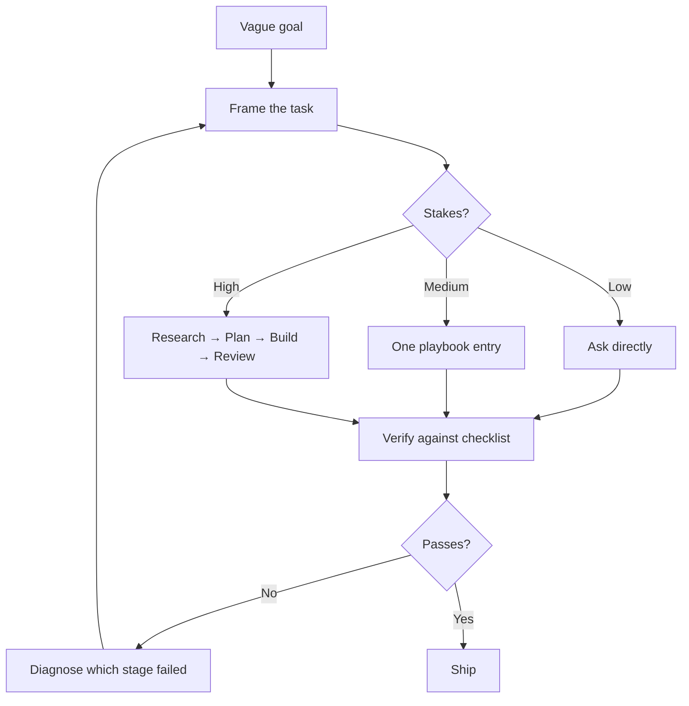

# Getting Started

The shortest path from "I have Claude Code installed" to "I am getting output I would ship."

**Time required:** about 15 minutes reading, plus one real task.

## Table of Contents

- [What This Repository Actually Gives You](#what-this-repository-actually-gives-you)
- [The Core Idea](#the-core-idea)
- [Your First Hour](#your-first-hour)
- [Anatomy of a Playbook Entry](#anatomy-of-a-playbook-entry)
- [Choosing an Entry](#choosing-an-entry)
- [Running Your First Entry](#running-your-first-entry)
- [The Three Habits That Matter Most](#the-three-habits-that-matter-most)
- [Common Beginner Mistakes](#common-beginner-mistakes)
- [Where to Go Next](#where-to-go-next)
- [Related](#related)
- [References](#references)

---

## What This Repository Actually Gives You

Not prompts. Prompts are the cheap part.

What you get is the **surrounding structure** that makes a prompt work:

| You bring | The playbook adds |
| --- | --- |
| A vague goal | A specific task definition with stated inputs |
| One big request | An ordered workflow with verifiable stages |
| Hope that the output is good | An objective checklist that decides |
| Surprise at bad output | A documented list of the ways this task fails |
| No sense of scale | Guidance on how much effort the task deserves |

If you take one prompt block from this repository and paste it without reading the sections around it, you have taken the least valuable part of the file.

## The Core Idea

Working well with Claude Code is mostly about **framing and verification**, not phrasing.

The loop that separates good results from bad ones is **`G → I → B`**: when output fails, go back and fix the *framing*, not the wording. Rephrasing a badly framed request produces a differently-worded bad result.

## Your First Hour

Do these in order. Do not skip step 1 — everything else compounds from it.

| # | Step | Why |
| --- | --- | --- |
| 1 | Read [Prompting-Guide.md](Prompting-Guide.md) | It defines the model of prompting the rest of the repository assumes |
| 2 | Set up a `CLAUDE.md` in your project — see [Installation.md](Installation.md#project-memory) | Persistent project context removes the need to re-explain your stack every session |
| 3 | Pick one real task you were going to do anyway | Learning on a fake task teaches you nothing about verification |
| 4 | Find the matching entry in [prompts/README.md](../prompts/README.md) | |
| 5 | Read the whole entry before running it | The Common Mistakes section will save you a round trip |
| 6 | Run it, then score the output against its Quality Checklist | This is the step people skip, and it is the step that matters |

> [!TIP]
> Use a task you already know the right answer to for your first run. You cannot calibrate your judgement of output quality on a task where you cannot tell good from bad.

## Anatomy of a Playbook Entry

Every file under `prompts/` has the same ten sections. Here is what each is for, and which ones people wrongly skip.

| Section | Purpose | Skip it? |
| --- | --- | --- |
| **Purpose** | Confirms this entry does what you think | Read it |
| **When to Use** | Tells you if a different entry fits better | Read it |
| **Inputs Required** | What to gather before starting | **Never skip.** Missing inputs are the top cause of generic output |
| **Workflow** | The ordered stages | Read it — it tells you where to intervene |
| **Claude Prompt** | The copy-paste block | No — it is the thing you came for |
| **Expected Output** | Lets you recognise a wrong result | **Never skip.** This is your comparison baseline |
| **Quality Checklist** | Objective pass/fail | **Never skip.** Without it you are guessing |
| **Common Mistakes** | Known failure modes | Read it before, not after |
| **Example** | A concrete filled-in run | Skim if the prompt is already clear |
| **Advanced Version** | Higher-effort variant | Only when stakes justify the cost |

## Choosing an Entry

Match the entry to the **stakes**, not to your enthusiasm.

| Stakes | Characteristics | Approach |
| --- | --- | --- |
| **Low** | Reversible, local, no one else sees it | Ask directly. No entry needed. |
| **Medium** | Touches a shipped surface, others will read it | One entry, run its checklist |
| **High** | Hard to reverse, external audience, real money | Research → Planning → Build → the relevant `quality/` review |
| **Critical** | Irreversible, regulated, or safety-relevant | Full chain, plus an adversarial second pass, plus human sign-off |

Over-processing a low-stakes task wastes your time. Under-processing a high-stakes one produces confident, plausible, wrong work — which is worse than obviously bad work, because it survives review.

## Running Your First Entry

A worked walkthrough of the mechanics.

**1. Gather the inputs first.** Open the entry's Inputs Required table and fill each row before you open Claude Code. If you cannot fill a required input, that is a real gap — resolve it rather than letting the model invent a plausible substitute.

**2. Replace every placeholder.** Prompt blocks use `{{UPPER_SNAKE_CASE}}`. Search the block for `{{` before sending; a leftover placeholder is the single most common cause of vague output.

**3. Run one workflow stage at a time for high-stakes work.** Pasting the whole prompt is fine for medium stakes. For high stakes, run stage by stage and check each result before continuing — a wrong assumption at stage 1 contaminates everything after it.

**4. Score against the checklist honestly.** Go item by item. "Mostly" is a fail. Note which items failed.

**5. Diagnose, do not rephrase.** Map the failure back to a cause:

| Failure | Likely cause | Fix |
| --- | --- | --- |
| Output is generic | Missing or vague inputs | Fill the Inputs table properly |
| Output is confident but wrong | No grounding step | Add a research stage — see [Research-Framework.md](Research-Framework.md) |
| Output ignores your constraints | Constraints buried mid-prompt | Move them to their own labelled block |
| Output is right but wrong shape | Expected Output not stated | Paste the Expected Output section into the prompt |
| Output drifts partway through | Task too large for one pass | Split it — see [AI-Agent-Workflow.md](AI-Agent-Workflow.md) |

## The Three Habits That Matter Most

Everything else in this repository is elaboration on these.

**1. State the constraints before the request.**
Constraints placed after a long request compete with everything above them. Put your stack, your non-negotiables, and your output format in a labelled block at the top.

**2. Define "done" before you start.**
If you cannot describe what a correct result looks like, you are not ready to ask for it — and you will accept the first plausible thing you see. The Expected Output and Quality Checklist sections exist to force this.

**3. Separate facts from assumptions, explicitly.**
Ask for assumptions to be listed in their own section. Assumptions buried inside prose read as facts, and reviewers stop questioning them. See [Research-Framework.md](Research-Framework.md#separating-fact-from-assumption).

## Common Beginner Mistakes

| Mistake | Why it happens | Fix |
| --- | --- | --- |
| Pasting the prompt block only | It looks like the valuable part | Read Inputs Required and Expected Output at minimum |
| Leaving `{{PLACEHOLDERS}}` unfilled | Easy to miss in a long block | Search for `{{` before sending |
| Accepting the first output | It reads well and you are busy | Run the Quality Checklist; fluency is not correctness |
| Rephrasing after a bad result | Feels like progress | Diagnose the framing failure instead |
| Using the Advanced Version by default | More thorough feels safer | It costs more time and attention for no gain on routine work |
| Re-explaining your project every session | Not knowing about project memory | Set up `CLAUDE.md` — see [Installation.md](Installation.md#project-memory) |
| Trusting version numbers and API shapes | They are stated confidently | Verify against official docs; see [Research-Framework.md](Research-Framework.md) |

## Where to Go Next

| Your situation | Next document |
| --- | --- |
| Claude Code is not set up on this project yet | [Installation.md](Installation.md) |
| Output is generic and I do not know why | [Prompting-Guide.md](Prompting-Guide.md) |
| I do not know how much effort a task deserves | [Thinking-Framework.md](Thinking-Framework.md) |
| I need output grounded in verified fact | [Research-Framework.md](Research-Framework.md) |
| My task is too big for one prompt | [AI-Agent-Workflow.md](AI-Agent-Workflow.md) |
| I want to work faster day to day | [Claude-Code-Best-Practices.md](Claude-Code-Best-Practices.md) |
| I need to define "production-ready" for my team | [Output-Standards.md](Output-Standards.md) |

## Related

- [prompts/README.md](../prompts/README.md) — the full A–Z entry index
- [checklists/](../checklists/) — verification lists to run during work
- [frameworks/](../frameworks/) — the mental models these documents reference
- [templates/prompt-template.md](../templates/prompt-template.md) — the entry skeleton

## References

- [Claude Code documentation](https://docs.claude.com/en/docs/claude-code) — official product documentation
- [Claude Code quickstart](https://docs.claude.com/en/docs/claude-code/quickstart) — official first-run guide
- [Claude Docs](https://docs.claude.com) — API, models, and platform reference
