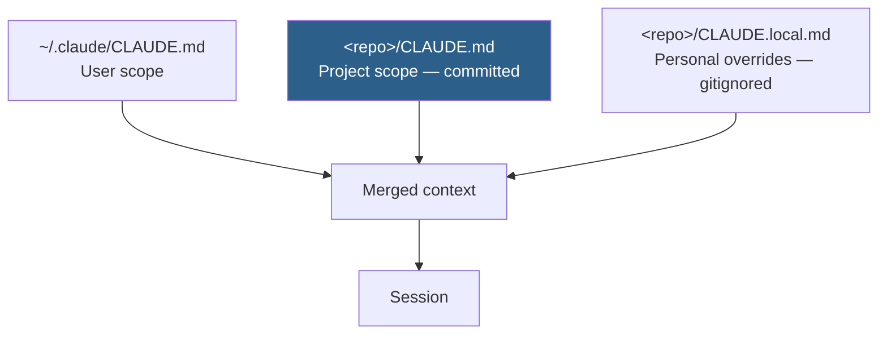
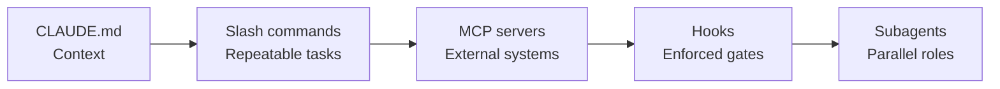

# Installation and Project Setup

Getting Claude Code running is the easy half. Configuring it so it understands your project is the half that determines output quality.

> [!IMPORTANT]
> Install commands, flags, and configuration keys change between releases. The [official Claude Code documentation](https://docs.claude.com/en/docs/claude-code) is the source of truth. Where this page and the official docs disagree, the official docs are right — please [open an issue](https://github.com/rajtiwariyng/claude-code-playbook/issues) so we can correct this page.

## Table of Contents

- [Where Claude Code Runs](#where-claude-code-runs)
- [Installing the CLI](#installing-the-cli)
- [Authentication](#authentication)
- [Verifying the Install](#verifying-the-install)
- [Project Memory](#project-memory)
- [Writing a CLAUDE.md That Earns Its Place](#writing-a-claudemd-that-earns-its-place)
- [Settings and Permissions](#settings-and-permissions)
- [Extending Claude Code](#extending-claude-code)
- [Recommended Repository Layout](#recommended-repository-layout)
- [Team Setup](#team-setup)
- [Troubleshooting](#troubleshooting)
- [Setup Checklist](#setup-checklist)
- [Related](#related)
- [References](#references)

---

## Where Claude Code Runs

| Surface | Best for | Notes |
| --- | --- | --- |
| **Terminal (CLI)** | Day-to-day engineering work | The primary surface; everything in this repository assumes it |
| **Desktop app** (macOS, Windows) | Working across several projects at once | |
| **Web** ([claude.ai/code](https://claude.ai/code)) | Quick work without a local setup | |
| **VS Code extension** | Staying inside your editor | Shares configuration with the CLI in the same project |
| **JetBrains extension** | IntelliJ, PhpStorm, WebStorm, PyCharm users | |

The surfaces share project configuration. A `CLAUDE.md` written for the CLI applies in the IDE extension too.

## Installing the CLI

Check the [official installation guide](https://docs.claude.com/en/docs/claude-code/setup) for current commands. As of this writing, the two supported paths are:

**npm** (requires a current Node.js LTS):

```bash
npm install -g @anthropic-ai/claude-code
```

**Native installer** — platform-specific scripts published by Anthropic, which avoid the Node.js dependency. See the official setup page for the current command for your platform.

> [!WARNING]
> Do not install with `sudo npm install -g`. Globally installing as root creates permission problems on update and is a common source of "command not found after upgrade" reports. If your global npm prefix needs `sudo`, [reconfigure the prefix](https://docs.npmjs.com/resolving-eacces-permissions-errors-when-installing-packages-globally) instead.

### Windows notes

Claude Code runs on Windows natively and under WSL. If you work across both, pick one and stay there — a project configured in WSL and opened natively will resolve paths differently, and `CLAUDE.md` instructions referencing shell commands will assume the wrong shell.

## Authentication

On first run, `claude` walks you through authentication. Two options:

| Method | Suits | Billing |
| --- | --- | --- |
| **Claude account** (Pro or Max) | Individuals and small teams | Included in the subscription, subject to usage limits |
| **API key** via [Claude Console](https://console.anthropic.com) | Teams needing usage attribution and spend controls | Metered per token |

> [!CAUTION]
> Never commit an API key. Never paste one into a `CLAUDE.md`, a prompt, or an issue. If a key is exposed, revoke it in the Console immediately — rotating is cheap, a leaked key is not. See [prompts/quality/security/secrets-management.md](../prompts/quality/security/secrets-management.md).

## Verifying the Install

```bash
claude --version     # Confirms the binary resolves
claude doctor        # Diagnoses common environment problems
```

Then start an interactive session in a project directory:

```bash
cd ~/projects/your-project
claude
```

A good first request, which tests both comprehension and repository access:

```text
Summarise this project's architecture in under 200 words.
Name the entry point, the main layers, and any pattern that would
surprise a new contributor. If you cannot determine something, say so
rather than guessing.
```

The last sentence matters. It gives you a read on whether the model will admit uncertainty on this codebase — which tells you how much verification your later work will need.

## Project Memory

`CLAUDE.md` at your repository root is the single highest-leverage configuration you can create. It is read automatically and gives every session your project's context without you re-explaining it.

```bash
# Inside a project, generate a starting CLAUDE.md from the codebase
claude
> /init
```

`/init` produces a reasonable draft by reading your project. Treat it as a first draft, not a finished file — it describes what your code *is*, and the valuable half of a `CLAUDE.md` is what your team has *decided*.

### Memory scopes



| Scope | File | Commit it? | Put here |
| --- | --- | --- | --- |
| User | `~/.claude/CLAUDE.md` | N/A | Your personal preferences across all projects |
| Project | `<repo>/CLAUDE.md` | **Yes** | Team-wide conventions, architecture, commands |
| Local | `<repo>/CLAUDE.local.md` | No — gitignore it | Machine-specific paths, personal shortcuts |

The project file is the one that matters. Committing it means your conventions are version-controlled, reviewable, and improve for everyone at once.

## Writing a CLAUDE.md That Earns Its Place

Most `CLAUDE.md` files fail the same way: they restate what is already obvious from the code. The model can read your `package.json`. It cannot read your team's decisions.

| Include | Omit |
| --- | --- |
| Conventions a newcomer would get wrong | Facts derivable from the code |
| Commands with non-obvious flags | Standard framework commands |
| Architectural decisions and their reasons | A file-by-file directory listing |
| Things that look like bugs but are deliberate | Generic best-practice advice |
| Areas that are off-limits or require review | Restating the framework's own documentation |
| Verification steps before claiming work is done | Aspirational rules nobody follows |

### A worked example

```markdown
# Project: Acme Billing API

## Stack
Laravel 11, PostgreSQL 16, Redis 7. PHP 8.3. Deployed to AWS ECS.

## Commands
- `make test` — full suite. Slow (~4 min). Run before claiming work is done.
- `make test-unit` — fast subset for iteration.
- `php artisan lint` — Pint plus PHPStan level 8. Must pass; CI blocks on it.

## Conventions
- Money is stored as integer minor units. Never use floats for currency.
- All monetary output goes through `Money::format()`. Do not format inline.
- Domain logic lives in `app/Domain/`. Controllers stay thin — no business
  logic in `app/Http/`.
- Database access outside a repository class is a review blocker.

## Deliberate oddities
- `LegacyInvoiceSync` polls rather than using webhooks. The upstream provider's
  webhooks are unreliable. Do not "fix" this.
- Migrations before 2024-06 use a different naming scheme. Leave them alone.

## Before saying work is complete
1. `make test` passes
2. `php artisan lint` passes
3. New endpoints have a feature test covering the unauthorised case
```

Every line of that file prevents a specific, likely mistake. That is the test for whether a line belongs.

> [!TIP]
> Grow `CLAUDE.md` reactively. When you correct the same misunderstanding twice, add a line. A file written all at once is mostly guesses; a file grown from real corrections is mostly signal.

## Settings and Permissions

Configuration lives in JSON, at three scopes:

| File | Scope | Commit it? |
| --- | --- | --- |
| `~/.claude/settings.json` | All your projects | N/A |
| `<repo>/.claude/settings.json` | Project, shared with the team | **Yes** |
| `<repo>/.claude/settings.local.json` | Project, personal only | No — gitignore it |

The most useful setting for daily work is a permission allowlist for commands you always approve, which removes repetitive prompts:

```json
{
  "permissions": {
    "allow": [
      "Bash(git status)",
      "Bash(git diff:*)",
      "Bash(npm run test:*)"
    ],
    "deny": [
      "Bash(rm -rf:*)"
    ]
  }
}
```

> [!WARNING]
> Allowlist read-only and idempotent commands freely. Be deliberate about anything that writes, deploys, or deletes — an allowlisted destructive command runs without asking. Never allowlist a broad wildcard like `Bash(*)`.

Consult the [official settings reference](https://docs.claude.com/en/docs/claude-code/settings) for the full key list, which changes more often than the concepts above.

## Extending Claude Code

Four extension points, in the order most teams adopt them:



| Extension | Lives in | Use it for |
| --- | --- | --- |
| **Slash commands** | `.claude/commands/*.md` | A prompt you run more than weekly. The file body becomes the command. |
| **MCP servers** | `claude mcp add …` | Giving Claude access to databases, issue trackers, browsers, or internal APIs |
| **Hooks** | `.claude/settings.json` | Enforcing something rather than documenting it — run lint after every edit, block commits on a failing check |
| **Subagents** | `.claude/agents/*.md` | Delegating a bounded task to a role with its own instructions and tool access |

Turning a playbook entry into a slash command is the natural next step once you use it regularly. See [AI-Agent-Workflow.md](AI-Agent-Workflow.md#turning-entries-into-commands).

## Recommended Repository Layout

```text
your-project/
├── CLAUDE.md                    # Committed. Project context and conventions.
├── CLAUDE.local.md              # Gitignored. Your personal overrides.
└── .claude/
    ├── settings.json            # Committed. Team permissions and hooks.
    ├── settings.local.json      # Gitignored. Your personal permissions.
    ├── commands/                # Committed. Shared slash commands.
    │   ├── review.md
    │   └── ship-check.md
    └── agents/                  # Committed. Shared subagent roles.
        └── security-reviewer.md
```

Add to `.gitignore`:

```gitignore
CLAUDE.local.md
.claude/settings.local.json
```

## Team Setup

The point of committing configuration is that improvements compound across the team instead of living in one person's head.

| Step | Detail |
| --- | --- |
| **1. Commit `CLAUDE.md`** | Review changes to it like code. It shapes everyone's output. |
| **2. Commit `.claude/settings.json`** | Agree the permission allowlist as a team. Discuss anything destructive. |
| **3. Share slash commands** | When someone writes a good prompt twice, promote it to `.claude/commands/`. |
| **4. Review AI-assisted changes normally** | Same review bar as any other change. Authorship does not alter the standard. |
| **5. Revisit quarterly** | Stale conventions in `CLAUDE.md` actively mislead. |

> [!NOTE]
> Treat `CLAUDE.md` as documentation your team already needed. Most of what belongs in it is what a new hire would ask in their first week — which is why writing one usually improves onboarding as a side effect.

## Troubleshooting

| Symptom | Likely cause | Fix |
| --- | --- | --- |
| `claude: command not found` after install | Global npm bin directory not on `PATH` | Run `npm bin -g` and add that path to your shell profile |
| Works in terminal, not in IDE | IDE launched before `PATH` changed | Restart the IDE fully, not just the window |
| Ignores your conventions | `CLAUDE.md` in a subdirectory, not the repo root | Move it to the root, or check you opened the project at the root |
| Constant permission prompts | No allowlist configured | Add read-only commands to `permissions.allow` |
| Slow on a large repository | Model reading more than it needs | Scope requests to specific paths; keep generated output out of the repo |
| Authentication fails repeatedly | Stale credentials or a proxy intercepting TLS | Re-run auth; check corporate proxy settings |
| Different behaviour across teammates | Someone's settings are in `settings.local.json` | Move shared configuration to the committed `settings.json` |

For anything not listed here, run `claude doctor` first, then check [the official troubleshooting guide](https://docs.claude.com/en/docs/claude-code/troubleshooting).

## Setup Checklist

- [ ] Claude Code installed; `claude --version` resolves
- [ ] `claude doctor` reports no problems
- [ ] Authenticated successfully
- [ ] `CLAUDE.md` exists at the repository root and is committed
- [ ] `CLAUDE.md` contains decisions, not just descriptions of the code
- [ ] `CLAUDE.md` states how to verify work is complete
- [ ] `.claude/settings.json` exists with a considered permission allowlist
- [ ] No destructive command is allowlisted without team agreement
- [ ] `CLAUDE.local.md` and `.claude/settings.local.json` are gitignored
- [ ] No secret appears in any committed configuration file
- [ ] Team agrees AI-assisted changes get the same review bar as any other

## Related

- [Getting-Started.md](Getting-Started.md) — what to do once setup is done
- [Claude-Code-Best-Practices.md](Claude-Code-Best-Practices.md) — daily working habits
- [AI-Agent-Workflow.md](AI-Agent-Workflow.md) — chaining entries and turning them into commands
- [snippets/](../snippets/) — reusable `CLAUDE.md` blocks by project type
- [prompts/quality/security/secrets-management.md](../prompts/quality/security/secrets-management.md) — handling credentials

## References

- [Claude Code setup](https://docs.claude.com/en/docs/claude-code/setup) — official installation guide
- [Claude Code settings](https://docs.claude.com/en/docs/claude-code/settings) — configuration reference
- [Claude Code memory](https://docs.claude.com/en/docs/claude-code/memory) — how `CLAUDE.md` is loaded
- [Claude Code troubleshooting](https://docs.claude.com/en/docs/claude-code/troubleshooting)
- [Model Context Protocol](https://modelcontextprotocol.io) — the MCP specification
- [Claude Console](https://console.anthropic.com) — API key management
