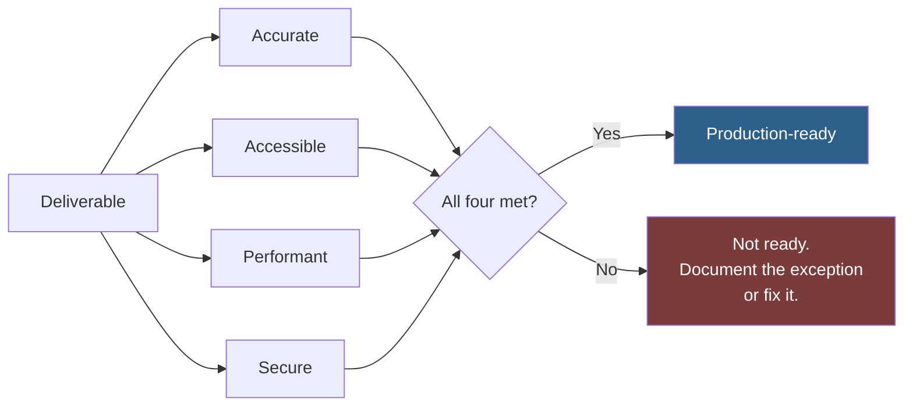

# Output Standards

The definition of "production-ready" used throughout this repository. Every entry's Quality Checklist derives from these standards.

The purpose of writing them down is to make "good enough" a shared, checkable judgement rather than an individual, negotiable one.

## Table of Contents

- [The Four Universal Standards](#the-four-universal-standards)
- [Accuracy Standard](#accuracy-standard)
- [Accessibility Standard](#accessibility-standard)
- [Performance Standard](#performance-standard)
- [Security Standard](#security-standard)
- [Code Standards](#code-standards)
- [Documentation Standards](#documentation-standards)
- [Design Standards](#design-standards)
- [Content Standards](#content-standards)
- [Definition of Done](#definition-of-done)
- [When a Standard Cannot Be Met](#when-a-standard-cannot-be-met)
- [Related](#references)

---

## The Four Universal Standards

These apply to every deliverable in this repository, regardless of type. They are not enhancements to request; they are the baseline.



| Standard | One-line test |
| --- | --- |
| **Accurate** | Every factual claim traces to a source |
| **Accessible** | A keyboard-only screen reader user can complete every task |
| **Performant** | It meets a budget that was set before implementation |
| **Secure** | Untrusted input is validated, authorisation is checked, secrets are external |

## Accuracy Standard

| Requirement | Detail |
| --- | --- |
| Facts are sourced | Every version, limit, API shape, price, and statistic cites a primary source |
| Assumptions are separated | In their own labelled section with a risk rating, never inline |
| Confidence is labelled | Verified / Documented / Estimate / Unverified / Opinion, used consistently |
| Gaps are stated | An acknowledged gap is a finding; a fabricated fill is a defect |
| Volatile claims are dated | Pricing, limits, and availability carry the date checked |
| No invented citations | A plausible-looking reference to a source that does not say it is worse than no citation |

Full treatment: [Research-Framework.md](Research-Framework.md).

## Accessibility Standard

**Baseline: [WCAG 2.2 Level AA](https://www.w3.org/TR/WCAG22/).** Not aspirational. The floor.

| Requirement | Check |
| --- | --- |
| Semantic HTML | Headings describe structure; landmarks are used; a `div` is not a button |
| Keyboard operable | Every interactive element is reachable and operable by keyboard alone |
| Visible focus | Focus indicator is always visible and meets contrast requirements |
| Contrast | 4.5:1 for body text, 3:1 for large text and UI components |
| Text alternatives | Meaningful images have alt text; decorative images have empty alt |
| Forms labelled | Every input has a programmatically associated label; errors are announced |
| No colour-only meaning | Information conveyed by colour is also conveyed another way |
| Motion respected | `prefers-reduced-motion` is honoured |
| Zoom supported | Usable at 200% zoom without horizontal scrolling |
| Announced changes | Dynamic updates reach assistive technology via live regions |

> [!IMPORTANT]
> Automated tools catch roughly a third of accessibility defects. Passing an automated audit is necessary and not sufficient. Keyboard-test the primary task path manually — it takes two minutes and finds what scanners cannot.

Full treatment: [prompts/quality/accessibility/](../prompts/quality/accessibility/).

## Performance Standard

**Budgets are set before implementation, not measured after.** A budget discovered after launch is a postmortem.

### Web baseline — [Core Web Vitals](https://web.dev/articles/vitals)

| Metric | Good | Measured at |
| --- | --- | --- |
| Largest Contentful Paint (LCP) | ≤ 2.5s | 75th percentile, field data |
| Interaction to Next Paint (INP) | ≤ 200ms | 75th percentile, field data |
| Cumulative Layout Shift (CLS) | ≤ 0.1 | 75th percentile, field data |

**Lab tools approximate; field data decides.** Lighthouse gives you a repeatable signal on your own machine. CrUX and real-user monitoring tell you what happened to actual users. A perfect Lighthouse score alongside poor field data means your test conditions differ from your users' conditions — and your users are right.

### General

| Requirement | Detail |
| --- | --- |
| Budget stated up front | Page weight, response time, query count |
| Measured, not assumed | Every optimisation claim carries a before and after |
| No N+1 queries | Verified by query log, not by inspection |
| Indexes justified | Every index exists for a named query |
| Images optimised | Modern formats, correct dimensions, lazy-loaded below the fold |
| Payload minimised | No shipping a full library for one function |
| Caching deliberate | Cache keys, TTLs, and invalidation are designed, not incidental |

Full treatment: [prompts/quality/performance/](../prompts/quality/performance/).

## Security Standard

**Baseline: [OWASP Top 10](https://owasp.org/Top10/) addressed explicitly.**

| Requirement | Detail |
| --- | --- |
| Input validated at the boundary | Allowlist where possible; type, length, format, range |
| Output encoded for its context | HTML, attribute, JS, URL, and SQL contexts each differ |
| Parameterised queries only | No string concatenation into SQL, ever |
| Authentication and authorisation separated | Being logged in is not permission to act on that resource |
| Authorisation checked server-side per request | Never rely on a hidden UI control |
| Secrets externalised | Environment or a secret manager. Never in code, config, logs, or prompts |
| Errors do not leak | No stack traces, internal paths, or identifiers in responses |
| Dependencies audited | Known-vulnerable versions are a release blocker |
| Rate limiting on public endpoints | Especially authentication, password reset, and anything expensive |
| Uploads restricted | Type, size, and stored outside the web root, served through a controlled path |
| Transport secured | HTTPS everywhere, HSTS, secure and `HttpOnly` cookies |

> [!WARNING]
> The most common real-world failure is not a missing control — it is a control applied inconsistently. One endpoint that skips the authorisation check is the whole vulnerability. Audit for coverage, not for existence.

Full treatment: [prompts/quality/security/](../prompts/quality/security/).

## Code Standards

| Standard | Requirement |
| --- | --- |
| **Complete** | No `TODO`, no stubs, no "implementation left as an exercise" |
| **Errors handled** | Failure paths are handled, not swallowed. Empty `catch` blocks are defects |
| **Tested** | New behaviour has a test that fails without the change |
| **Typed** | Where the language supports it, types are used and pass strict checking |
| **Consistent** | Matches the surrounding code's conventions, not general best practice |
| **Named clearly** | Names state intent. Comments explain why, never what |
| **Single responsibility** | A unit that needs "and" to describe it should be two units |
| **Dependencies justified** | Each added dependency earns its maintenance and security cost |
| **No dead code** | Unused code is deleted, not commented out. Git remembers it |
| **No secrets** | Not in code, not in config, not in test fixtures |

### On SOLID and Clean Architecture

Both are referenced throughout this repository, and both are commonly over-applied.

| Principle | Real value | Over-application |
| --- | --- | --- |
| Single responsibility | Units you can understand and test alone | Classes with one method that call each other in a chain |
| Open/closed | Extending without editing tested code | Abstraction layers for variation that never arrives |
| Liskov substitution | Subtypes that do not surprise callers | — |
| Interface segregation | Consumers depend only on what they use | An interface per method |
| Dependency inversion | Swappable infrastructure, testable domain | Injecting things that will only ever have one implementation |

> [!TIP]
> The test for an abstraction is whether it has **two real implementations today**, not whether it might one day. Abstraction added for hypothetical future variation costs comprehension now and usually turns out to be the wrong shape when the variation actually arrives.

## Documentation Standards

| Standard | Requirement |
| --- | --- |
| Audience named | Written for a specific reader with specific knowledge |
| Answers "why" | The code shows what; documentation exists for the reasons |
| Runnable examples | Copy-paste working, not illustrative fragments presented as complete |
| Errors documented | What fails, what the message means, what to do |
| Kept current | Wrong documentation is worse than none — it is trusted |
| No filler | No "in today's fast-paced world", no restating the function signature in prose |
| Scannable | Headings, tables, and lists. Long prose blocks do not get read |
| Linked | Related material is cross-referenced |

## Design Standards

| Standard | Requirement |
| --- | --- |
| Intentional | Every choice has a reason beyond "it is the default" |
| Systematic | Spacing, type, and colour come from a scale, not from taste per element |
| Responsive | Works from 320px to ultrawide; no horizontal scroll |
| Accessible | Meets the accessibility standard above; contrast is verified, not eyeballed |
| Content-first | Layout serves real content, not lorem ipsum of a convenient length |
| States designed | Loading, empty, error, and partial states exist — not just the happy path |
| Consistent | Same element behaves identically everywhere |
| Performant | Fonts and images are budgeted; decorative assets justify their weight |

**Design the empty and error states first.** They are the most commonly skipped deliverable in design work, and the states users reach when they are already frustrated. A design that only works on the happy path has not been tested against the cases that decide whether people keep using it.

## Content Standards

| Standard | Requirement |
| --- | --- |
| Accurate | Claims are sourced; nothing is invented for effect |
| Specific | "Reduces onboarding from 3 days to 4 hours", not "dramatically faster" |
| Honest | No implied capabilities the product lacks |
| Structured | Headings reflect actual hierarchy; scannable |
| Plain | Jargon only where the audience uses it |
| Legally sound | Claims that need substantiation have it; testimonials are real |
| Attributed | Images and quotes are licensed and credited — see [assets/](../assets/) |

## Definition of Done

A deliverable is done when all of these are true. Not most.

```text
UNIVERSAL
  □ Meets the accuracy standard — facts sourced, assumptions separated
  □ Meets the accessibility standard — WCAG 2.2 AA
  □ Meets the performance standard — against a budget set beforehand
  □ Meets the security standard — OWASP Top 10 addressed
  □ Scored against the entry's Quality Checklist, item by item
  □ Known limitations documented, not hidden

CODE
  □ Runs. Verified by running it, not by reading it.
  □ Tests pass, and the output was seen, not assumed
  □ New behaviour has a test that fails without the change
  □ Linter and type checker pass
  □ Full diff read
  □ No secrets, no dead code, no TODOs

DOCUMENTATION
  □ Examples were executed, not drafted
  □ Links resolve
  □ A stranger could follow it without asking a question

DESIGN
  □ Loading, empty, error, and partial states exist
  □ Keyboard path tested manually
  □ Contrast measured, not judged by eye
  □ Tested at 320px and at 200% zoom

BEFORE SHIPPING
  □ Someone other than the author reviewed it
  □ Rollback is possible, and someone knows how
```

## When a Standard Cannot Be Met

Sometimes a standard genuinely cannot be met — a legacy constraint, a third-party component, a deadline that is itself a business decision.

The rule: **document the exception, do not silently drop the standard.**

```markdown
## Known limitations

**Accessibility:** The embedded vendor scheduling widget does not meet
WCAG 2.2 AA — it traps keyboard focus and lacks form labels. We do not
control its markup.

- **Impact:** Keyboard and screen reader users cannot complete booking
  through the widget.
- **Mitigation:** A phone number and email alternative is offered adjacent
  to the widget, with equal visual prominence.
- **Owner:** Platform team. Vendor ticket VEN-4471, opened 2026-07-12.
- **Revisit:** Vendor's Q4 accessibility release, or replace the widget.
```

This is an acceptable outcome. What is not acceptable is shipping the same situation with no record, so that nobody knows the gap exists, nobody owns it, and it is rediscovered by a user or a regulator.

> [!IMPORTANT]
> An undocumented exception is indistinguishable from an oversight six months later. The documentation is what converts "we cut a corner deliberately, here is why" into something a team can act on.

## Related

- [Research-Framework.md](Research-Framework.md) — the accuracy standard in full
- [Thinking-Framework.md](Thinking-Framework.md) — how much rigour a task warrants
- [Claude-Code-Best-Practices.md](Claude-Code-Best-Practices.md) — verification discipline
- [Style-Guide.md](Style-Guide.md) — writing standards for this repository
- [checklists/](../checklists/) — the runnable verification lists
- [prompts/quality/](../prompts/quality/) — the entries that enforce these standards

## References

- [WCAG 2.2](https://www.w3.org/TR/WCAG22/) — accessibility conformance standard
- [WAI-ARIA Authoring Practices](https://www.w3.org/WAI/ARIA/apg/) — accessible component patterns
- [OWASP Top 10](https://owasp.org/Top10/) — web application security risks
- [OWASP Application Security Verification Standard](https://owasp.org/www-project-application-security-verification-standard/)
- [Core Web Vitals](https://web.dev/articles/vitals) — performance metric definitions
- [Web Content Accessibility Guidelines quick reference](https://www.w3.org/WAI/WCAG22/quickref/)
