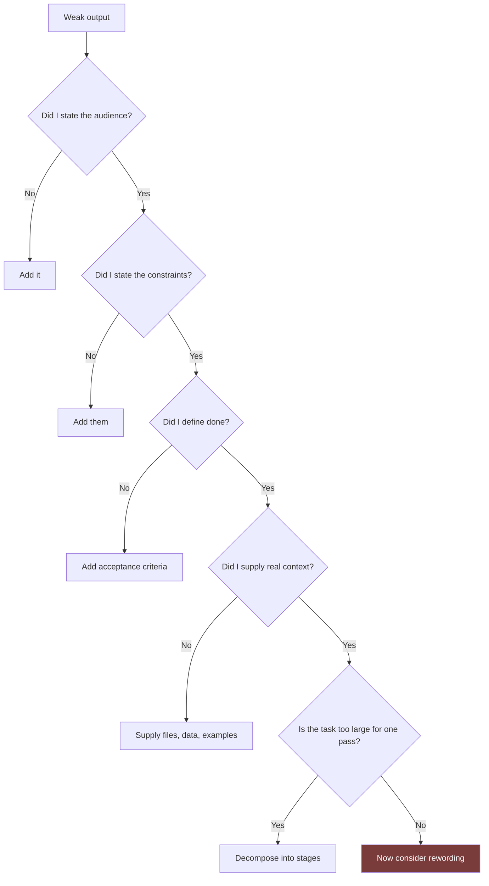

# Prompting Guide

The model of prompting that every entry in this repository assumes.

This is not a list of magic phrases. It is an argument that **prompt quality is mostly task-definition quality**, plus the specific techniques that follow from that.

## Table of Contents

- [The Central Claim](#the-central-claim)
- [The Anatomy of a Strong Prompt](#the-anatomy-of-a-strong-prompt)
- [Technique 1: Front-Load Constraints](#technique-1-front-load-constraints)
- [Technique 2: Specify the Output Shape](#technique-2-specify-the-output-shape)
- [Technique 3: Give Negative Space](#technique-3-give-negative-space)
- [Technique 4: Demand Separated Assumptions](#technique-4-demand-separated-assumptions)
- [Technique 5: Assign a Role With Standards](#technique-5-assign-a-role-with-standards)
- [Technique 6: Decompose Before You Ask](#technique-6-decompose-before-you-ask)
- [Technique 7: Ask for the Failure Modes](#technique-7-ask-for-the-failure-modes)
- [Technique 8: Build in a Verification Step](#technique-8-build-in-a-verification-step)
- [Prompting in a Codebase](#prompting-in-a-codebase)
- [Iteration: Diagnose, Do Not Rephrase](#iteration-diagnose-do-not-rephrase)
- [Anti-Patterns](#anti-patterns)
- [Quick Reference](#quick-reference)
- [Related](#related)
- [References](#references)

---

## The Central Claim

> A prompt cannot be more specific than your understanding of the task.

Most disappointing output traces back to a request that was underspecified in a way the requester did not notice. The model fills gaps with the statistically ordinary choice. If you did not say the audience, you get a general audience. If you did not say the constraints, you get an unconstrained solution. If you did not say what "good" means, you get something that pattern-matches to good.

This has a practical consequence: **when output is weak, interrogate the request before rewording it.**



Rewording is the last resort, not the first move. It is the box people reach for first because it is the cheapest, and it is the one that almost never contains the problem.

## The Anatomy of a Strong Prompt

Six components. Not every prompt needs all six, but knowing which one you omitted is how you debug a bad result.

| # | Component | Answers | Omitting it causes |
| --- | --- | --- | --- |
| 1 | **Role and standards** | Whose judgement should apply? | Generic, unopinionated output |
| 2 | **Context** | What is the situation, stack, audience? | Plausible but inapplicable output |
| 3 | **Task** | What exactly should be produced? | Scope drift |
| 4 | **Constraints** | What must be true, and what is forbidden? | Solutions you cannot use |
| 5 | **Output shape** | What format, length, structure? | Right content, wrong artefact |
| 6 | **Acceptance criteria** | How will this be judged? | No basis to reject weak output |

A compact example using all six:

```text
ROLE
You are a senior backend engineer reviewing code for a payments system.
You optimise for correctness and auditability over cleverness.

CONTEXT
Laravel 11 API, PostgreSQL 16. This endpoint processes refunds and is
called by our support tool. Roughly 400 calls/day. Money is stored as
integer minor units.

TASK
Review app/Http/Controllers/RefundController.php for correctness and
security defects.

CONSTRAINTS
- Do not propose changes that alter the public API contract.
- Do not suggest new dependencies.
- Assume the database cannot be migrated this sprint.

OUTPUT
A table with columns: Severity, Location, Defect, Failure scenario, Fix.
Ordered by severity. No summary paragraph.

ACCEPTANCE
Every row must name a concrete input or state that triggers the defect.
Findings you cannot demonstrate a trigger for go in a separate
"Unverified concerns" list.
```

The last block is what most prompts lack, and it does the most work. It makes speculation visibly separate from demonstrated defects — so you can trust the first list and treat the second appropriately.

## Technique 1: Front-Load Constraints

Constraints placed after a long request compete with everything above them. Put them in their own labelled block near the top.

| Instead of | Write |
| --- | --- |
| "Build a contact form and by the way we can't use JavaScript libraries" | A `CONSTRAINTS` block stating "No third-party JS. Vanilla only." before the task |
| "Write the migration — oh, and it has to be zero-downtime" | `CONSTRAINTS: Must be zero-downtime. Table has 40M rows, actively written.` |

Constraints are more valuable than requirements, because there are far more ways to satisfy a requirement than you have use for. Requirements narrow toward a solution; constraints eliminate the ones you cannot ship.

## Technique 2: Specify the Output Shape

Content and format are separate failures. You can get exactly the right analysis in exactly the wrong artefact.

```text
OUTPUT FORMAT
A single Markdown table. Columns: Endpoint, Method, Auth required,
Rate limit, Notes. One row per endpoint. No prose before or after.
```

For structured work, showing one filled row beats describing the format:

```text
Return rows in this shape:

| POST /v1/refunds | Bearer, scope refunds:write | 10/min | Idempotency-Key required |
```

> [!TIP]
> When you need output that another tool will consume, say so and name the tool. "Output valid JSON matching this schema, no code fence, no commentary" produces something parseable; "output JSON" often produces JSON wrapped in explanation.

## Technique 3: Give Negative Space

Stating what you do *not* want is often more efficient than enumerating what you do.

| Positive framing alone | Add negative space |
| --- | --- |
| "Write concise documentation" | "No introductory paragraph. No 'in today's fast-paced world'. No restating the function signature in prose." |
| "Suggest performance improvements" | "Do not suggest caching, we already cache. Do not suggest rewriting in another language." |
| "Review this component" | "Do not comment on formatting — Prettier handles it. Focus on state management and re-render behaviour." |

This is especially effective at suppressing the ordinary answer when the ordinary answer is one you have already ruled out.

## Technique 4: Demand Separated Assumptions

Assumptions buried in prose read as facts. Reviewers skim past them. Forcing them into their own section makes them attackable.

```text
Before the deliverable, output an "Assumptions" section listing every
gap you filled that I did not specify. Mark each as:
  [SAFE]   — a conventional default, low risk if wrong
  [RISKY]  — materially changes the result if wrong
Do not proceed past three RISKY assumptions; ask instead.
```

The three-assumption stop is a useful circuit breaker. Beyond that count you are not getting a deliverable, you are getting fiction with your topic in it.

See [Research-Framework.md](Research-Framework.md#separating-fact-from-assumption) for the full treatment.

## Technique 5: Assign a Role With Standards

A role alone is weak — "you are a senior developer" is close to noise, because it does not say what a senior developer *prefers*. A role plus its priorities is strong.

| Weak | Strong |
| --- | --- |
| "You are a UX designer." | "You are a UX designer who optimises for task completion over visual novelty, and who treats WCAG 2.2 AA as a floor rather than a goal." |
| "You are a security expert." | "You are a security engineer who assumes all input is hostile, prefers eliminating a class of bug over patching an instance, and refuses to recommend a control you cannot explain the bypass for." |
| "You are a technical writer." | "You are a technical writer who deletes more than they add, refuses to document what the code already states plainly, and writes for a reader who is under deadline pressure." |

The pattern: **role + what they optimise for + what they refuse to do.**

Reusable role definitions live in [prompts/core/system/](../prompts/core/system/).

## Technique 6: Decompose Before You Ask

Some tasks cannot be done well in one pass, no matter how good the prompt is. The signal is when a task contains a decision that changes everything downstream.

| Symptom | Decompose into |
| --- | --- |
| "Build a booking system" | Domain model → API contract → schema → endpoints → tests |
| "Redesign our site" | Audit → information architecture → content → page design → build |
| "Make this faster" | Measure → identify the dominant cost → fix one thing → re-measure |
| "Review this PR" | Correctness → security → performance → style |

Doing these in one pass produces output that is *self-consistent with its own early guesses* — which is worse than being wrong in one place, because the wrongness is distributed and hard to isolate.

See [AI-Agent-Workflow.md](AI-Agent-Workflow.md) for staging multi-pass work.

## Technique 7: Ask for the Failure Modes

Add this to any design or planning prompt:

```text
Before recommending an approach, list the three most likely ways it
fails in production. If any failure is both likely and severe,
recommend a different approach instead.
```

This does two things. It surfaces risk you would otherwise discover late, and it changes the recommendation itself — an approach evaluated against its own failure modes is often not the approach that comes to mind first.

The adversarial version, for high-stakes work:

```text
Argue against the approach you just recommended. Take the position of
a reviewer whose job is to stop this from shipping. What is the
strongest case against it?
```

## Technique 8: Build in a Verification Step

The most common shipped defect is work that was never checked against its own stated requirements.

```text
After producing the deliverable, verify it against these criteria and
report per criterion: PASS, FAIL, or UNVERIFIABLE with the reason.
Do not adjust the deliverable to make criteria pass — report honestly.

1. Every endpoint documents its error responses
2. No endpoint returns internal identifiers
3. Every write operation is idempotent or documents why not
```

The instruction not to retrofit is important. Without it, a self-check tends to become a self-justification.

> [!IMPORTANT]
> A self-check is a filter, not a guarantee. It catches obvious misses cheaply. It does not replace running the tests, reading the diff, or human review on anything that matters.

## Prompting in a Codebase

Working inside a real repository changes the calculus, because context is available rather than described.

| Practice | Why |
| --- | --- |
| **Point at files, do not describe them** | "Follow the pattern in `app/Domain/Billing/`" beats three paragraphs of description, and cannot drift from reality |
| **Name the exemplar** | "Match the structure of `UserRepository.php`" gives a concrete target |
| **Scope the search** | On a large repo, say where to look. Unscoped exploration wastes effort and context |
| **State the verification command** | "Run `make test` before saying this is done" — put it in `CLAUDE.md` so you never repeat it |
| **Ask for the plan on non-trivial work** | Cheaper to redirect a plan than to unwind an implementation |
| **Put durable rules in `CLAUDE.md`** | Anything you have said twice belongs in project memory, not in the next prompt |

See [Installation.md](Installation.md#writing-a-claudemd-that-earns-its-place) for what belongs in project memory.

## Iteration: Diagnose, Do Not Rephrase

When output is wrong, identify *which component was missing* rather than rewriting the sentence.

| Symptom | Missing component | Fix |
| --- | --- | --- |
| Generic, could apply to any project | Context | Supply the real stack, audience, and constraints |
| Technically correct, unusable here | Constraints | State what is forbidden and what cannot change |
| Right content, wrong artefact | Output shape | Specify format explicitly, show one example row |
| Confident and factually wrong | Grounding | Add a research stage; require sources — see [Research-Framework.md](Research-Framework.md) |
| Good start, degrades toward the end | Scope | Decompose; the task exceeded one pass |
| Ignores something you said | Placement | Move it into a labelled block near the top |
| Plausible but you cannot verify it | Acceptance criteria | Define pass/fail before asking |
| Hedged and non-committal | Role | Assign a role with explicit priorities and a decision mandate |

> [!TIP]
> Keep the prompts that worked. A prompt you have refined three times is an asset — promote it to a slash command or a playbook entry rather than rediscovering it next month.

## Anti-Patterns

| Anti-pattern | Why it fails | Instead |
| --- | --- | --- |
| Politeness padding | "Please", "if you don't mind" consume attention and add nothing | Be direct; directness is not rudeness here |
| Threats and urgency theatre | "This is CRITICAL!!!", "my job depends on this" | State real stakes plainly if they change the approach |
| Stacked superlatives | "world-class, cutting-edge, best-in-class" | Name the actual quality bar |
| Everything in one paragraph | Constraints get buried and lost | Use labelled blocks |
| Asking for "best practices" | Produces the median of everything written online | Ask for the trade-off between named specific options |
| Accepting first output | Fluency reads as correctness | Score against a checklist |
| Rewriting a prompt five times | Rewording rarely fixes framing | Diagnose the missing component |
| Multi-turn context drift | Requirements from turn 2 fade by turn 12 | Restate constraints, or start fresh with a consolidated prompt |
| "Make it better" | No definition of better | Name the dimension: faster, shorter, more testable, more accessible |

## Quick Reference

Print this.

```text
BEFORE ASKING
  □ Can I state what a correct result looks like?
  □ Have I named the audience?
  □ Have I listed what is forbidden, not just what is wanted?
  □ Do I have the real context, or am I describing it from memory?
  □ Is this one task, or several wearing a trench coat?

IN THE PROMPT
  □ Role with explicit priorities
  □ Context: stack, scale, audience
  □ Task: one clear deliverable
  □ Constraints in their own block, near the top
  □ Output shape, with an example if structured
  □ Acceptance criteria

AFTER
  □ Scored against the checklist, item by item
  □ Assumptions reviewed separately from facts
  □ Factual claims spot-checked against official sources
  □ If it failed: diagnosed the missing component, did not just reword
```

## Related

- [Thinking-Framework.md](Thinking-Framework.md) — how much reasoning effort to allocate
- [Research-Framework.md](Research-Framework.md) — grounding output in verified fact
- [AI-Agent-Workflow.md](AI-Agent-Workflow.md) — staging work that exceeds one pass
- [Output-Standards.md](Output-Standards.md) — what the acceptance criteria should demand
- [prompts/core/system/](../prompts/core/system/) — reusable role definitions
- [templates/prompt-template.md](../templates/prompt-template.md) — the entry skeleton

## References

- [Claude Code documentation](https://docs.claude.com/en/docs/claude-code)
- [Claude prompt engineering guide](https://docs.claude.com/en/docs/build-with-claude/prompt-engineering/overview) — official prompting documentation
- [Claude Docs](https://docs.claude.com)
