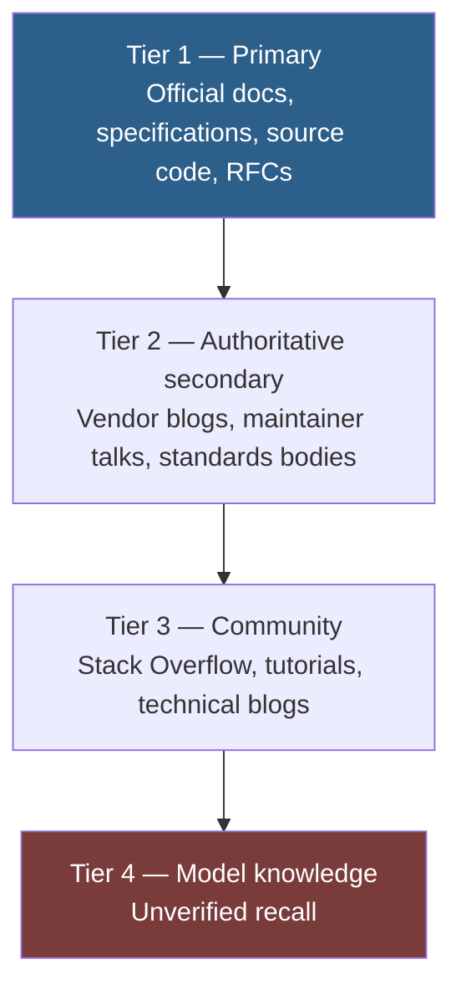
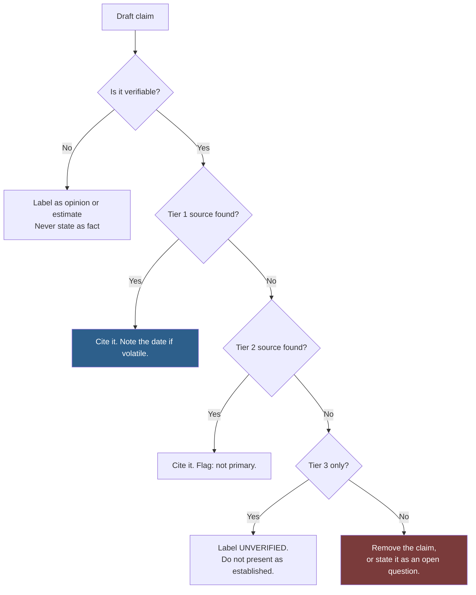
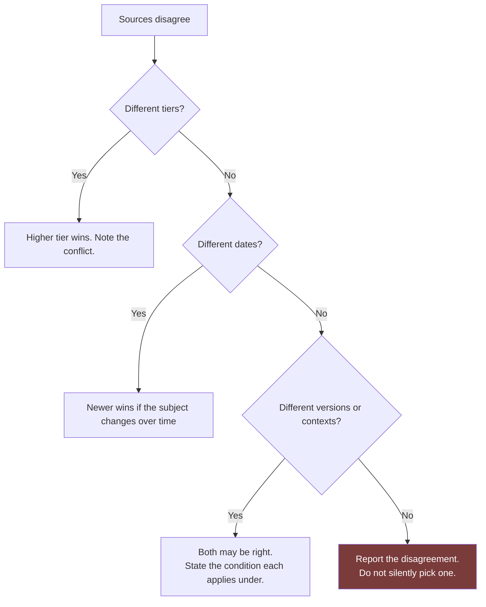

# Research Framework

How to produce output grounded in verified fact rather than confident-sounding plausibility.

This document defines the sourcing hierarchy, verification workflow, and honesty conventions used everywhere in this repository.

## Table of Contents

- [The Problem This Solves](#the-problem-this-solves)
- [The Source Hierarchy](#the-source-hierarchy)
- [What Must Always Be Verified](#what-must-always-be-verified)
- [The Verification Workflow](#the-verification-workflow)
- [Separating Fact From Assumption](#separating-fact-from-assumption)
- [Confidence Labelling](#confidence-labelling)
- [Evaluating a Source](#evaluating-a-source)
- [Handling Conflicting Sources](#handling-conflicting-sources)
- [Citation Standards](#citation-standards)
- [Research Prompts](#research-prompts)
- [Common Mistakes](#common-mistakes)
- [Quick Reference](#quick-reference)
- [Related](#related)
- [References](#references)

---

## The Problem This Solves

Fluent output and correct output feel identical while you are reading them. This is the central hazard of working with a language model: the failure mode is not gibberish, it is **a well-formed, well-reasoned, confidently-stated answer that happens to be wrong.**

The specific things that go wrong most often:

| Category | Typical failure |
| --- | --- |
| Version numbers | A version that does not exist, or existed two years ago |
| API shapes | A method with plausible parameters that the library never had |
| CLI flags | A flag that reads correctly and was never implemented |
| Configuration keys | A key that follows the naming convention and is not real |
| Limits and quotas | A specific-sounding number with no basis |
| Pricing | Stale by definition; changes without announcement |
| Statistics | A precise figure attributed to a study that does not say it |
| Citations | A real author, a real journal, a paper that does not exist |

Each of these is stated with the same confidence as things that are true. **Confidence carries no information about correctness.** Treat the two as unrelated.

## The Source Hierarchy

When sources disagree, the higher tier wins. When you cite, cite the highest tier available.



| Tier | Sources | Use for | Never use for |
| --- | --- | --- | --- |
| **1 — Primary** | Official documentation, formal specifications, source code, RFCs, filed accounts | Any factual claim | — |
| **2 — Authoritative secondary** | Vendor engineering blogs, conference talks by maintainers, standards-body guidance | Rationale, roadmap, context | Exact API shapes when Tier 1 exists |
| **3 — Community** | Stack Overflow, tutorials, technical blogs, forums | Technique, workarounds, "how people actually do it" | Any specification detail |
| **4 — Model knowledge** | Unverified recall | Drafting, hypothesis generation, structure | **Any published factual claim** |

> [!IMPORTANT]
> Tier 4 is not a source. It is a starting point for a search. Anything that reaches a deliverable must have been promoted to Tier 1 or 2, or labelled as unverified.

### The source-code exception

Reading the implementation is Tier 1 and often beats documentation, because documentation lags code. But note *which version* you read — a behaviour on `main` may not be in any release. Cite the tag or commit.

## What Must Always Be Verified

Not everything needs a citation. These do, without exception:

| Claim type | Why | Verify against |
| --- | --- | --- |
| Version numbers | Fabricated constantly, and specific | Official release page, registry, changelog |
| API signatures | Plausible shapes get invented | Official API reference, or the source |
| CLI flags and commands | Same | Official CLI reference, or `--help` |
| Configuration keys | Same | Official configuration reference |
| Limits, quotas, timeouts | Specific numbers imply authority | Official limits page |
| Pricing | Changes without notice | Official pricing page, dated |
| Compliance and legal claims | Consequences of error are severe | The regulation or standard text |
| Statistics and benchmarks | Frequently misattributed | The primary study, with its methodology |
| Security guidance | Wrong advice creates vulnerabilities | OWASP, CVE databases, vendor advisories |
| Anything with a number in it | Numbers read as researched | The source of that number |

> [!TIP]
> A useful reflex: **any sentence containing a number, a version, or a proper noun is a citation candidate.** If you cannot produce the source in under a minute, that sentence is not ready to publish.

## The Verification Workflow



### Stage by stage

**1. Draft freely.** Getting a shape down is faster than researching every sentence as you write it. Tier 4 recall is fine here.

**2. Mark every claim.** Read the draft and mark each factual assertion. Anything with a number, version, name, or "must/always/never".

**3. Verify in tier order.** Start at Tier 1. Stop when you find it. Do not settle for a blog post that repeats what the docs say — cite the docs.

**4. Record what you checked, and when.** For volatile facts, the date is part of the claim:

```markdown
Rate limit: 50 requests per minute per key.
Source: [Official API limits](https://example.com/docs/limits), checked 2026-07-27.
```

**5. Handle failures explicitly.** A claim you could not verify has three legitimate outcomes: label it, weaken it to an estimate, or delete it. Publishing it unlabelled is not among them.

**6. Separate the assumptions.** See below.

## Separating Fact From Assumption

Assumptions embedded in prose are invisible. Reviewers read them as established and stop questioning them — which is exactly backwards, since assumptions are the part most worth attacking.

**The rule: assumptions live in their own labelled section, never inline.**

```markdown
## Assumptions

| # | Assumption | Risk | If wrong |
| --- | --- | --- | --- |
| 1 | Traffic stays under 10k req/day | LOW | Add a cache layer; ~1 day of work |
| 2 | The vendor's webhook delivery is at-least-once | **HIGH** | Duplicate charges. Needs idempotency regardless. |
| 3 | We can migrate the schema in Q4 | MEDIUM | Design must work without the migration |
```

The `If wrong` column is what makes this useful rather than decorative. It converts a vague worry into a cost estimate, which is what lets someone decide whether to go verify it.

### The prompt

```text
Before the deliverable, output an "Assumptions" section as a table with
columns: #, Assumption, Risk (LOW/MEDIUM/HIGH), If wrong.

List every gap you filled that I did not specify. Include assumptions
you consider obvious — those are the ones that go unchallenged.

If more than three assumptions are HIGH risk, stop and ask instead of
producing the deliverable.
```

## Confidence Labelling

Use these consistently. Inconsistent confidence language is worse than none, because readers stop being able to calibrate.

| Label | Means | Example |
| --- | --- | --- |
| **Verified** | Tier 1 source, cited | "Node.js 22 entered LTS in October 2024 ([release schedule](https://nodejs.org/en/about/previous-releases))" |
| **Documented** | Tier 2 source, cited | "The team describes this as the recommended pattern (vendor engineering blog, 2025)" |
| **Common practice** | Tier 3, widely reported | "Commonly implemented with a token bucket, though not specified" |
| **Estimate** | Derived, with stated method | "Roughly 40ms p50, extrapolated from the 10k-row benchmark. Untested at production scale." |
| **Unverified** | Could not confirm | "**Unverified:** the limit is reportedly 100/min. Not found in official documentation." |
| **Opinion** | Judgement, not fact | "In my view, the operational cost outweighs the latency gain here." |

> [!WARNING]
> Never launder an estimate into a fact by dropping the qualifier in a later draft. This happens most often when a number moves from a research note into a slide. If it was an estimate on Monday, it is an estimate in the deck.

## Evaluating a Source

Before trusting a source, especially Tier 2 and 3:

| Question | Red flag |
| --- | --- |
| **Who wrote it?** | No named author, no organisation |
| **When?** | Undated, or older than the last major version of the thing described |
| **Do they have first-hand access?** | Summarising someone else's summary |
| **Do they cite primary sources?** | Assertions with no links |
| **What is the incentive?** | Vendor comparison published by a vendor |
| **Is it reproducible?** | Benchmark with no hardware, dataset, or method |
| **Has it been superseded?** | Correct for v2, you are on v5 |

Dates deserve particular attention in fast-moving ecosystems. A well-written article about a JavaScript framework from three years ago may be entirely wrong now and will not say so.

## Handling Conflicting Sources



Reporting a disagreement is a legitimate and often correct output:

```markdown
> [!NOTE]
> Sources disagree on the default timeout. The [official configuration
> reference](https://example.com/config) states 30s; the [migration
> guide](https://example.com/migrate) states 60s. Both checked 2026-07-27.
> Verify empirically before relying on either.
```

That paragraph is more useful than confidently stating one of them, because it tells the reader exactly what to go and check.

## Citation Standards

| Rule | Detail |
| --- | --- |
| Link the primary source | Not an article about the primary source |
| Use descriptive link text | `[Node.js release schedule](url)`, never `[here](url)` or a bare URL |
| Date volatile claims | Pricing, limits, versions, availability |
| Cite the version | "As of Laravel 11" — behaviour is version-scoped |
| Deep-link where possible | Link the specific section, not the docs homepage |
| Quote sparingly and exactly | If you quote, quote verbatim and mark it |
| Cite the study, not the article | Articles routinely misstate their sources |

## Research Prompts

**Grounded research**, for when you need facts you can rely on:

```text
Research {{TOPIC}} for the purpose of {{PURPOSE}}.

SOURCING RULES
- Prefer official documentation and specifications above all else.
- If a claim rests only on a blog post or forum answer, label it UNVERIFIED.
- Do not state a version number, limit, or API shape you cannot cite.
- Note the date checked for anything volatile (pricing, limits, availability).

OUTPUT
1. Findings — each with its source link and confidence label
2. Conflicts — where sources disagree, presented without resolving them
3. Gaps — what you could not determine, and what would answer it
4. Assumptions — table: #, Assumption, Risk, If wrong

Do not fill gaps with plausible content. An explicit gap is more
useful to me than a confident guess.
```

**Fact-check an existing document:**

```text
Fact-check the document below.

For each factual claim, output a row:
| Claim | Verdict | Source | Note |

Verdicts: VERIFIED (Tier 1 cited), LIKELY (Tier 2), UNVERIFIED (no source
found), CONTRADICTED (source says otherwise), UNVERIFIABLE (not the kind
of claim that can be checked).

Do not rewrite the document. Do not soften a CONTRADICTED verdict.
List claims in document order.

---
{{DOCUMENT}}
```

More entries: [prompts/core/research/](../prompts/core/research/).

## Common Mistakes

| Mistake | Why it happens | Fix |
| --- | --- | --- |
| Trusting confident output | Fluency reads as authority | Verify claims, not tone |
| Citing an article that cites the docs | It came up first in search | Follow through to the primary source |
| Accepting undated sources | The date is not prominent | Treat undated technical content as suspect |
| Letting estimates become facts | The qualifier gets dropped in revision | Keep confidence labels attached through every draft |
| Burying assumptions in prose | It reads more smoothly | Separate section, always |
| Filling gaps to look complete | A gap feels like failure | A stated gap is a finding; a fabricated fact is a defect |
| Verifying only surprising claims | Familiar claims feel safe | Familiar-sounding wrong facts are the ones that survive review |
| Skipping verification under time pressure | It feels like the cuttable step | It is the step whose absence you discover publicly |

## Quick Reference

```text
BEFORE PUBLISHING ANY CLAIM
  □ Does this sentence contain a number, version, or proper noun?
  □ If yes — can I produce the source in under a minute?
  □ Is the source Tier 1 or 2?
  □ Is it dated, and is the date recent enough to matter?
  □ Does it describe the version I am actually using?

ALWAYS VERIFY
  Versions · API shapes · CLI flags · Config keys · Limits
  Pricing · Statistics · Security guidance · Compliance claims

NEVER
  □ State an unverified fact without a label
  □ Fill a gap with a plausible guess
  □ Drop a confidence qualifier during revision
  □ Cite a summary when the primary source exists
  □ Bury an assumption in prose

WHEN YOU CANNOT VERIFY
  Label it · Weaken it to an estimate · Or delete it
  (Publishing it unlabelled is not an option)
```

## Related

- [Thinking-Framework.md](Thinking-Framework.md) — how much verification a task warrants
- [Prompting-Guide.md](Prompting-Guide.md) — asking for grounded output
- [Output-Standards.md](Output-Standards.md) — accuracy requirements for deliverables
- [prompts/core/research/](../prompts/core/research/) — the research entries
- [checklists/](../checklists/) — pre-ship verification lists

## References

- [Claude Docs](https://docs.claude.com) — official platform documentation
- [OWASP](https://owasp.org/) — primary source for web security guidance
- [W3C standards](https://www.w3.org/standards/) — primary source for web platform specifications
- [IETF RFCs](https://www.rfc-editor.org/) — primary source for internet protocols
- [Semantic Versioning 2.0.0](https://semver.org/) — how to read version numbers correctly
