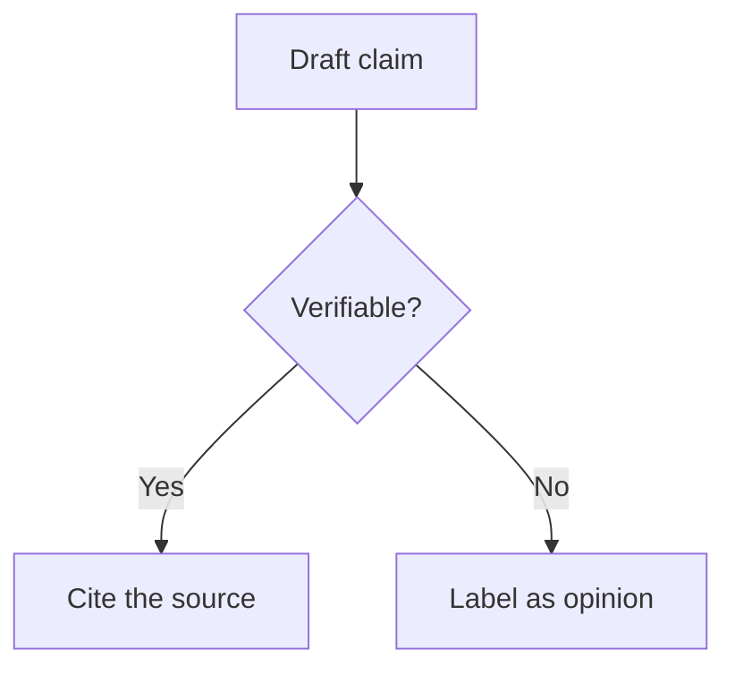

# Style Guide

The writing standard for this repository. Following it is what makes a hundred files read like one book instead of a hundred blog posts.

Applies to every Markdown file here. Contributors should read this before opening a pull request.

## Table of Contents

- [Voice](#voice)
- [Document Structure](#document-structure)
- [Headings](#headings)
- [Tables](#tables)
- [Lists](#lists)
- [Code Blocks](#code-blocks)
- [Callouts](#callouts)
- [Diagrams](#diagrams)
- [Links and Cross-References](#links-and-cross-references)
- [Placeholders](#placeholders)
- [Terminology](#terminology)
- [Numbers, Dates, and Units](#numbers-dates-and-units)
- [Words to Avoid](#words-to-avoid)
- [File Naming](#file-naming)
- [Review Checklist](#review-checklist)
- [Related](#related)
- [References](#references)

---

## Voice

| Rule | Example |
| --- | --- |
| **Second person, present tense** | "Run the audit", not "The audit should be run" |
| **Active voice** | "The linter blocks the commit", not "The commit is blocked by the linter" |
| **Direct** | "Do not commit secrets", not "It is generally advisable to avoid committing secrets" |
| **Concrete over abstract** | "Reduces build time from 4 min to 40 s", not "significantly improves build performance" |
| **Confident where confident, hedged where uncertain** | "This fails on Windows" if verified; "This reportedly fails on Windows — unverified" if not |
| **They/them for unspecified people** | "When a reviewer sees this, they will…" |

### Tone

Write for a competent professional who is short on time and has seen a lot of documentation. That reader:

- Does not need to be motivated. Skip the "why this matters in today's landscape" opening.
- Will stop reading if the first paragraph does not say something specific.
- Would rather be told a hard thing plainly than encouraged vaguely.

### On being opinionated

This repository takes positions. "It depends" is only acceptable when followed by *what it depends on*, stated concretely enough to decide with.

| Weak | Strong |
| --- | --- |
| "There are pros and cons to both approaches." | "Use option A below 10k rows. Above that, the sequential scan dominates and option B wins." |
| "Consider whether caching is appropriate." | "Cache when the read:write ratio exceeds roughly 10:1 and staleness of up to a minute is acceptable." |

## Document Structure

Every file follows this order:

```markdown
# Title                          ← One H1, matches the filename in meaning

One-paragraph statement of what this is and who it is for.

## Table of Contents             ← Required for files over ~150 lines

...

---

## [Content sections]

## Related                        ← Required. Minimum two in-repo links.

## References                     ← Required. External sources.
```

Files under `prompts/` additionally use the ten mandatory sections defined in [CONTRIBUTING.md](../CONTRIBUTING.md#the-ten-section-entry-structure), between the intro and `## Related`.

## Headings

| Rule | Detail |
| --- | --- |
| One H1 per file | The document title |
| Title Case for H1 and H2 | "Common Mistakes", "The Source Hierarchy" |
| Sentence case for H3 and below | "Stage by stage", "The source-code exception" |
| No skipped levels | H2 → H4 is a defect |
| Descriptive, not clever | "Handling Conflicting Sources", not "When Worlds Collide" |
| No trailing punctuation | Except a genuine question |
| Unique within a file | Duplicate headings break anchor links |

## Tables

**Use a table whenever content has parallel structure.** Three or more items that share attributes belong in a table, not in prose or a bullet list.

| Use a table for | Not for |
| --- | --- |
| Comparisons | A single item's description |
| Options with trade-offs | Sequential steps (use an ordered list) |
| Mistake → cause → fix | Prose that happens to have three sentences |
| Requirements with detail | Anything where a cell would need a paragraph |

Formatting:

- Always include a header row.
- Keep cells to one line where possible. If a cell needs a paragraph, the content is not tabular.
- Left-align by default; do not add alignment colons without a reason.
- Bold the value in a cell when one option is the recommendation.
- Do not pad columns to align the source. It creates noisy diffs for no rendered benefit.

## Lists

| Type | Use for |
| --- | --- |
| Ordered (`1.`) | Sequences where order matters |
| Unordered (`-`) | Sets where order does not matter |
| Task (`- [ ]`) | Checklists intended to be worked through |

Use `-` for bullets, never `*` or `+`. Do not nest more than two levels — deeper nesting means the content wants to be a table or a set of subsections.

## Code Blocks

**Always language-tagged.** An untagged block is a lint failure.

````markdown
```bash
npm install -g @anthropic-ai/claude-code
```
````

| Tag | Use for |
| --- | --- |
| `bash` | Shell commands |
| `powershell` | Windows-specific commands |
| `json`, `yaml`, `toml` | Configuration |
| `php`, `js`, `ts`, `tsx`, `python`, `sql` | Source code |
| `text` | Prompt blocks, ASCII diagrams, plain output |
| `markdown` | Markdown examples |
| `mermaid` | Diagrams |
| `diff` | Before/after changes |

Rules:

- Commands are copy-paste runnable. No `$` prompt prefix — it breaks copy-paste.
- Never mix command and output in one block. Separate them, or use `text` for output.
- Illustrative fragments are labelled as such in the surrounding prose.
- Never put a real credential in a code block, including a fake-looking one.

## Callouts

GitHub alert syntax only. **Maximum three per file** — a page of callouts is a page with no emphasis.

```markdown
> [!NOTE]
> Useful context the reader might not have.

> [!TIP]
> A better way to do something.

> [!IMPORTANT]
> Necessary for success. Skipping it causes failure.

> [!WARNING]
> Risk of a bad outcome — data loss, security, cost.

> [!CAUTION]
> Reserved for genuinely dangerous actions.
```

| Alert | Use when | Do not use for |
| --- | --- | --- |
| `NOTE` | Context that aids understanding | Ordinary prose you want to look important |
| `TIP` | A non-obvious improvement | Restating what the section just said |
| `IMPORTANT` | Skipping it causes failure | Emphasis for its own sake |
| `WARNING` | Real risk of harm | Mild inconvenience |
| `CAUTION` | Irreversible damage | Anything less than that |

> [!TIP]
> If you find yourself wanting a fourth callout, the document's structure is doing too little work. Promote the content to its own section instead.

## Diagrams

Use [Mermaid](https://mermaid.js.org/) — GitHub renders it natively, it diffs as text, and it needs no asset pipeline.

````markdown

````

| Rule | Detail |
| --- | --- |
| Diagram when structure is the point | Decision flows, stage chains, hierarchies |
| Do not diagram a list | A sequence with no branching is an ordered list |
| Keep under ~12 nodes | Larger diagrams do not render legibly on mobile |
| Label every edge in a decision flow | An unlabelled branch is ambiguous |
| Use colour sparingly | Highlight the one node that matters, not five |
| Never encode meaning in colour alone | Accessibility; the label must carry it |

Colours used in this repository, for consistency:

| Purpose | Style |
| --- | --- |
| Emphasis / recommended path | `fill:#2d5f8b,color:#fff` |
| Failure / anti-pattern | `fill:#7a3b3b,color:#fff` |

## Links and Cross-References

| Rule | Example |
| --- | --- |
| Relative links in-repo | `[Style Guide](Style-Guide.md)`, `[security](../prompts/quality/security/)` |
| Absolute links external | Full `https://` URL |
| Descriptive link text | `[WCAG 2.2](url)` — never `[here](url)` or `[this link](url)` |
| No bare URLs in prose | Wrap them in link syntax |
| Deep-link to sections | `[Research-Framework.md](Research-Framework.md#the-source-hierarchy)` |
| Every file has a `Related` section | Minimum two in-repo links |
| Every file has a `References` section | External sources, official first |

> [!IMPORTANT]
> Deep links into this repository are treated as a public API. Renaming a file or heading breaks other people's bookmarks and citations, so it is a major version change. See [CHANGELOG.md](../CHANGELOG.md#versioning-policy).

## Placeholders

Inside prompt blocks only, using `{{UPPER_SNAKE_CASE}}`:

```text
Audit {{PROJECT_NAME}} for accessibility defects.
Target conformance: {{WCAG_LEVEL}}.
Scope: {{PAGES_OR_ROUTES}}.
```

| Rule | Detail |
| --- | --- |
| Format | `{{UPPER_SNAKE_CASE}}`, double braces, no spaces inside |
| Naming | Descriptive. `{{TARGET_AUDIENCE}}`, not `{{X}}` |
| Documentation | Every placeholder appears in the entry's Inputs Required table |
| Scope | Prompt blocks only. Never in prose, headings, or code samples |
| Optional inputs | Mark them optional in the Inputs table, with the default stated |

## Terminology

Use these consistently. Inconsistent naming makes search fail.

| Use | Not |
| --- | --- |
| Claude Code | claude-code, ClaudeCode, CC |
| `CLAUDE.md` | claude.md, Claude.MD |
| entry / playbook entry | prompt file, recipe, template |
| prompt block | the prompt, the copy-paste |
| repository | repo (in prose; `repo` is fine in code) |
| directory | folder (in technical instructions) |
| MCP server | MCP, mcp server |
| subagent | sub-agent, agent (when specifically a Claude Code subagent) |
| slash command | command (when specifically a slash command) |

### Spelling

British English (`optimise`, `behaviour`, `licence` as a noun). **Exception:** technical terms, API names, and quotations keep their original spelling — `authorization` header, `color` CSS property, `license` in the MIT text.

## Numbers, Dates, and Units

| Rule | Example |
| --- | --- |
| Spell out one to nine in prose | "three stages", "12 endpoints" |
| Always use numerals with units | "3 s", "4 GB", "200 ms" |
| ISO 8601 for dates | `2026-07-27`, never `27/07/2026` |
| Absolute dates, never relative | "as of 2026-07-27", never "recently" or "last month" |
| Space before unit | "200 ms", not "200ms" — except in code |
| Precision matches confidence | "roughly 40 ms" if estimated; "41.3 ms" only if measured |
| Currency with the code | "USD 49/month" |

> [!NOTE]
> Relative time is the most common decay bug in documentation. "The current version" and "recently released" become wrong silently. Absolute dates go stale visibly, which is what you want.

## Words to Avoid

| Avoid | Because | Instead |
| --- | --- | --- |
| "simply", "just", "easy" | Condescending when the reader is stuck | Delete it |
| "obviously", "of course" | Same | Delete it |
| "leverage" (as a verb) | Corporate filler | "use" |
| "utilise" | Filler | "use" |
| "robust", "seamless", "powerful" | Unfalsifiable marketing | State the actual property |
| "best practice" | Appeals to authority instead of reason | Explain why, name the trade-off |
| "in today's fast-paced world" | Pure filler | Delete the whole sentence |
| "it is important to note that" | Filler preamble | Delete it and state the thing |
| "very", "really", "extremely" | Adds no information | Delete, or use a stronger word |
| "should probably" | Undermines the guidance | Take a position |
| "state-of-the-art", "cutting-edge" | Ages badly, means nothing | Name the specific capability |
| "delve", "tapestry", "landscape" | Recognisably generated filler | Delete |

## File Naming

| Type | Convention | Example |
| --- | --- | --- |
| Documentation | `Title-Case-Hyphenated.md` | `Research-Framework.md` |
| Playbook entries | `kebab-case.md` | `owasp-top-10.md` |
| Folder indexes | `README.md` | |
| Directories | `kebab-case/` | `landing-pages/` |
| Root files | `SCREAMING_CASE.md` | `CONTRIBUTING.md` |

The filename should match the H1 in meaning. `owasp-top-10.md` titled "OWASP Top 10 Security Audit" is fine; titled "General Security Review" is not.

## Review Checklist

Run this before opening a pull request.

```text
STRUCTURE
  □ One H1, matching the filename in meaning
  □ Table of Contents present if over ~150 lines
  □ Related section with at least two in-repo links
  □ References section with official sources first
  □ For prompts/: all ten mandatory sections, in order

VOICE
  □ Second person, present tense, active voice
  □ Takes a position rather than listing pros and cons
  □ No words from the avoid list
  □ No motivational preamble

FORMATTING
  □ Every code block is language-tagged
  □ Parallel content is in tables, not prose
  □ Three or fewer callouts
  □ Bullets use `-`, nesting no deeper than two levels
  □ Headings are unique within the file

LINKS
  □ Relative for in-repo, absolute for external
  □ Descriptive link text, no "here"
  □ All links resolve

FACTS
  □ Every version, limit, and API shape is cited
  □ Volatile claims carry the date checked
  □ Dates are ISO 8601 and absolute
  □ Assumptions are separated from facts

CONSISTENCY
  □ Terminology matches the table above
  □ Reads like the neighbouring files
```

## Related

- [CONTRIBUTING.md](../CONTRIBUTING.md) — the contribution process and entry structure
- [Output-Standards.md](Output-Standards.md) — the quality bar for deliverables
- [Research-Framework.md](Research-Framework.md) — sourcing and citation standards
- [templates/prompt-template.md](../templates/prompt-template.md) — the entry skeleton

## References

- [GitHub Flavored Markdown specification](https://github.github.com/gfm/)
- [GitHub alert syntax](https://docs.github.com/en/get-started/writing-on-github/getting-started-with-writing-and-formatting-on-github/basic-writing-and-formatting-syntax#alerts)
- [Mermaid documentation](https://mermaid.js.org/)
- [markdownlint rules](https://github.com/DavidAnson/markdownlint/blob/main/doc/Rules.md)
- [ISO 8601 date format](https://www.iso.org/iso-8601-date-and-time-format.html)
