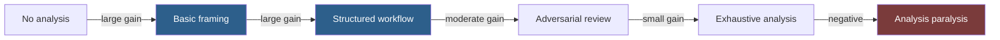
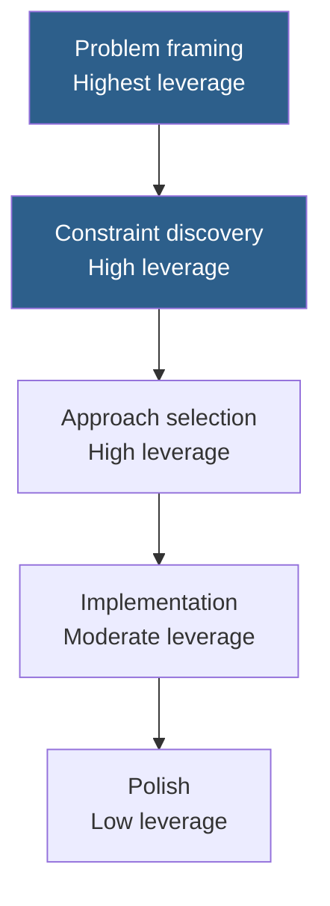

# Thinking Framework

How to decide how much reasoning a task deserves, and how to spend it well.

This is the highest-leverage habit in the repository. Most wasted effort comes from applying deep analysis to trivial work, or shallow analysis to work that will be expensive to get wrong.

## Table of Contents

- [Why Effort Allocation Matters](#why-effort-allocation-matters)
- [The Reversibility Test](#the-reversibility-test)
- [Four Effort Tiers](#four-effort-tiers)
- [Signals That You Have Mis-Tiered](#signals-that-you-have-mis-tiered)
- [Where Reasoning Should Be Spent](#where-reasoning-should-be-spent)
- [The Decision Record](#the-decision-record)
- [Reasoning Patterns](#reasoning-patterns)
- [Adversarial Review](#adversarial-review)
- [Knowing When to Stop](#knowing-when-to-stop)
- [Common Mistakes](#common-mistakes)
- [Quick Reference](#quick-reference)
- [Related](#related)
- [References](#references)

---

## Why Effort Allocation Matters

Effort is not free, and its value is not linear. The relationship between analysis and outcome quality looks roughly like this:



The first two steps are almost always worth taking. The last one never is. The interesting question is where between C and E a given task sits — and that is decided by consequences, not by how interesting the task feels.

> [!IMPORTANT]
> Difficulty and stakes are different axes. A hard problem with a cheap failure deserves less ceremony than an easy problem with an expensive one. Deleting a column is trivially easy and catastrophically permanent.

## The Reversibility Test

One question, asked first, decides most of it:

> **If this is wrong, what does it cost to find out and fix?**

| Cost to reverse | Examples | Implication |
| --- | --- | --- |
| **Seconds** | Rename a local variable, reword a paragraph | Just do it. Deliberation costs more than the mistake. |
| **Hours** | Refactor a module, redesign a page, rewrite a section | Frame properly, verify once. |
| **Days to weeks** | API contract shipped to consumers, schema change, brand direction | Research, plan, review before building. |
| **Never** | Data deleted, money moved, statements published, credentials leaked | Full chain plus adversarial review plus human sign-off. No exceptions. |

The trap is that irreversible actions rarely announce themselves. A migration that drops a column, a script that rewrites history, a press release, an email to a client list — all look like ordinary tasks right up until they are not.

> [!WARNING]
> Before any destructive or outward-facing action, stop and name what is being destroyed or published, and who sees it. This single pause prevents more damage than any amount of downstream review.

## Four Effort Tiers

| Tier | Reversibility | Audience | Approach | Time budget |
| --- | --- | --- | --- | --- |
| **T1 — Direct** | Seconds | You | Ask plainly. No workflow, no checklist. | < 5 min |
| **T2 — Structured** | Hours | Your team | One playbook entry. Run its Quality Checklist. | 15–60 min |
| **T3 — Staged** | Days | Customers | Research → Plan → Build → Review. Human gate between stages. | Hours |
| **T4 — Adversarial** | Never | Public, regulated, or financial | T3 plus a review pass explicitly trying to break it, plus human sign-off. | As long as it takes |

### Worked classifications

| Task | Tier | Why |
| --- | --- | --- |
| Fix a typo in a code comment | T1 | Reversible instantly, seen by no one until reviewed |
| Add a unit test for existing behaviour | T1 | Tests are cheap to correct; a wrong test fails loudly |
| Add a REST endpoint to an internal service | T2 | Reversible in hours, consumed by teammates |
| Write a landing page for a campaign | T2 | Editable after publish, but public |
| Design the public API for a new product | T3 | Consumers integrate against it; breaking it later is expensive |
| Migrate a 40M-row table | T3 | Reversible with effort, high blast radius if wrong |
| Change how refunds are calculated | T4 | Money. Errors compound silently and are hard to unwind. |
| Publish financial results or a security advisory | T4 | Irreversible publication, external reliance |
| Delete production data, even "unused" | T4 | Definitionally irreversible |

> [!TIP]
> When you cannot decide between two tiers, pick the higher one *once* and see what the extra effort actually surfaced. If it found nothing, you have calibration evidence for next time. Guessing repeatedly without checking never improves your judgement.

## Signals That You Have Mis-Tiered

**Too low** — you will notice these during or after:

- You are surprised by something you should have anticipated
- You find yourself asking "wait, does this affect…?" mid-implementation
- The output is coherent but built on an assumption nobody stated
- Review finds a structural problem, not a detail problem
- You cannot explain why the approach was chosen over the alternatives

**Too high** — these are quieter, and cost more than people think:

- The analysis restates what you already knew
- You have three options and no criteria that separate them
- The plan is longer than the implementation would have been
- You are refining a decision whose alternatives differ by minutes of work
- Nobody, including you, will read the document you are producing

## Where Reasoning Should Be Spent

Within a task, effort is not evenly valuable. Spend it at the front.



| Stage | Question | Cost of getting it wrong |
| --- | --- | --- |
| **Framing** | Am I solving the right problem? | Everything downstream is wasted |
| **Constraints** | What must be true? What is forbidden? | You build something you cannot ship |
| **Approach** | Which option, and why not the others? | Expensive rework at the worst time |
| **Implementation** | Is this correct and clear? | Localised, findable by tests and review |
| **Polish** | Is this as good as it could be? | Usually nothing |

Most teams invert this. They deliberate over implementation details and accept the framing as given — which is why so much carefully-built work solves a problem nobody had.

## The Decision Record

For T3 and T4 work, write down the decision before building. Five lines is enough, and it pays for itself the first time someone asks "why did we do it this way?"

```markdown
## Decision: Idempotency strategy for the refunds endpoint

**Context:** Support tool retries on timeout. Duplicate refunds move real money.
**Options considered:**
  1. Client-supplied Idempotency-Key, stored 24h — chosen
  2. Server-side dedup on (order_id, amount, 5-min window) — rejected, breaks legitimate partial refunds
  3. No idempotency, rely on client discipline — rejected, we do not control the client
**Decision:** Option 1. Key required; missing key is a 400.
**Assumption:** 24h retention covers all realistic retry windows. [RISKY — verify with support]
**Revisit if:** We onboard a client whose retry logic exceeds 24h.
```

The **Revisit if** line is the one people leave out, and the one that keeps a decision record from becoming archaeology. It tells a future reader what change invalidates this reasoning.

## Reasoning Patterns

Four patterns worth naming, because knowing which one a task needs saves you from defaulting to the wrong one.

| Pattern | Use when | Prompt shape |
| --- | --- | --- |
| **Enumerate then eliminate** | Several viable approaches, unclear winner | "List every viable approach. Then eliminate each against these constraints, stating which constraint kills it." |
| **Failure-first** | Designing something that must not break | "Before recommending anything, list the three most likely production failures. Then recommend an approach that survives them." |
| **Decompose to atoms** | Task feels large and shapeless | "Break this into the smallest independently verifiable pieces. For each, state its input, output, and how I would test it alone." |
| **Invert** | Stuck, or suspicious of an obvious answer | "What would guarantee this fails? Now what does avoiding all of that imply about the design?" |

Inversion is underused. Asking "how would I make this project fail?" surfaces risks that "how do I make it succeed?" never reaches, because the failure question has concrete answers and the success question has aspirational ones.

## Adversarial Review

T4 work requires someone whose job is to stop it. Since you rarely have that person available on demand, ask for it explicitly:

```text
You have just produced a recommendation. Now take the opposite role.

You are a reviewer whose job is to prevent this from shipping. You are
measured on defects that reach production, not on being agreeable.

Produce:
1. The strongest technical case against this approach
2. The failure mode you would bet on occurring first
3. What evidence would change your mind
4. A verdict: BLOCK, or APPROVE WITH CONDITIONS, and the conditions

Do not soften the criticism. If the approach is sound, say so plainly
and briefly rather than manufacturing objections.
```

The last instruction matters. Without it, adversarial prompts generate objections to fill the space, and manufactured criticism trains you to ignore criticism.

## Knowing When to Stop

Stop when any of these is true:

| Signal | Meaning |
| --- | --- |
| The remaining options differ by less than the cost of deciding | Pick one and move |
| New analysis is restating earlier analysis | You have reached the end of what thinking can tell you |
| The next unknown can only be resolved by building or measuring | Go build the smallest thing that resolves it |
| You are optimising a decision that is cheap to reverse | It was T1 or T2 all along |
| You have the information but not the confidence | Confidence is not a deliverable. Write the assumption down and proceed. |

> [!NOTE]
> "I need more information" is sometimes true and often a stalling reflex. Test it: name the specific fact you are missing and how you would obtain it. If you cannot name one, you have enough information and are avoiding a decision.

## Common Mistakes

| Mistake | Why it happens | Fix |
| --- | --- | --- |
| Tiering by difficulty instead of consequence | Hard problems feel important | Ask the reversibility question first |
| Treating every task as T3 | Thoroughness feels safe and diligent | Thoroughness on T1 work is procrastination with good posture |
| Treating destructive work as T2 | It looks like an ordinary command | Any delete, deploy, publish, or payment is T4 by default |
| Deep analysis of implementation, none of framing | Implementation is concrete and comfortable | Front-load: framing errors cost the most |
| Producing a plan nobody reads | Process theatre | If no one will read it, the artefact is not the point — make the decision and record five lines |
| Skipping the decision record on T3+ | It feels like overhead in the moment | It costs five minutes now and saves an archaeology session later |
| Adversarial review that agrees with itself | The prompt did not license real disagreement | Explicitly assign the blocking role and permit a BLOCK verdict |

## Quick Reference

```text
FIRST QUESTION
  If this is wrong, what does it cost to find out and fix?
    Seconds  → T1  Ask directly
    Hours    → T2  One entry + its checklist
    Days     → T3  Research → Plan → Build → Review
    Never    → T4  T3 + adversarial pass + human sign-off

ALWAYS T4, REGARDLESS OF HOW SMALL IT LOOKS
  □ Deletes data              □ Moves money
  □ Publishes externally      □ Touches auth or secrets
  □ Rewrites history          □ Cannot be undone

SPEND EFFORT HERE
  Framing > Constraints > Approach > Implementation > Polish

STOP WHEN
  □ Options differ by less than the cost of choosing
  □ Analysis is repeating itself
  □ The next unknown needs building, not thinking
```

## Related

- [Prompting-Guide.md](Prompting-Guide.md) — the components of a well-framed request
- [AI-Agent-Workflow.md](AI-Agent-Workflow.md) — executing T3 and T4 chains
- [Research-Framework.md](Research-Framework.md) — grounding decisions in verified fact
- [Output-Standards.md](Output-Standards.md) — what "done" means per tier
- [frameworks/](../frameworks/) — the named models referenced here
- [prompts/core/planning/](../prompts/core/planning/) — planning entries for T3 work

## References

- [Claude Code documentation](https://docs.claude.com/en/docs/claude-code)
- [Claude prompt engineering guide](https://docs.claude.com/en/docs/build-with-claude/prompt-engineering/overview)
- [Architectural Decision Records](https://adr.github.io/) — the fuller form of the decision record pattern
