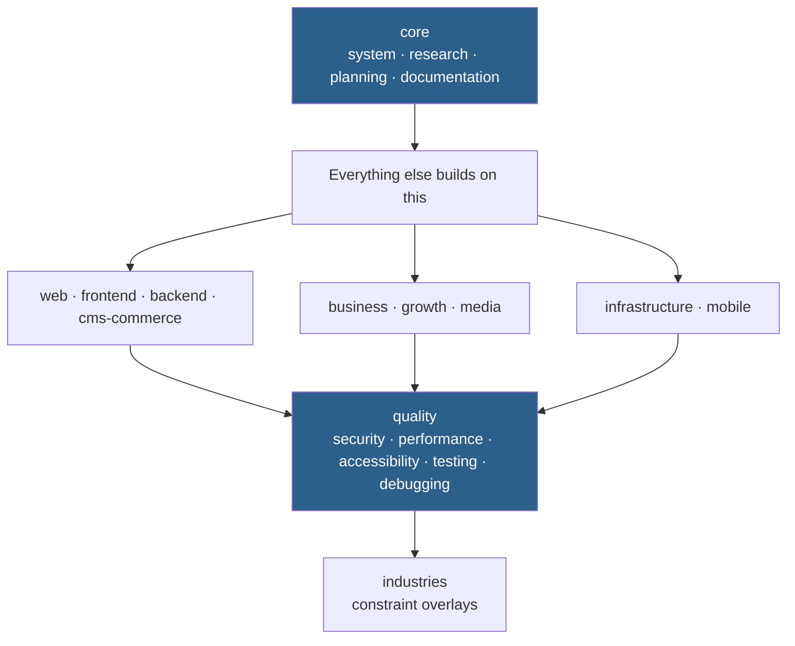

# Playbook Entries

Every entry in the playbook, indexed two ways: by domain and A–Z.

## Table of Contents

- [How Entries Are Organised](#how-entries-are-organised)
- [Domain Index](#domain-index)
- [A–Z Index](#az-index)
- [Entry Status](#entry-status)
- [Choosing an Entry](#choosing-an-entry)
- [The Ten-Section Structure](#the-ten-section-structure)
- [Related](#related)

---

## How Entries Are Organised

Entries are grouped by domain. Within a domain, one **base entry** usually carries the depth and the others defer to it rather than repeating it.

**`core/` and `quality/` are authoritative.** Roles, research method, security, performance, and accessibility live there and are referenced everywhere else rather than restated. Guidance restated across twenty folders is out of sync by the next release.

The [folder ownership rules](../CONTRIBUTING.md#folder-ownership) define which folder owns each topic that could plausibly live in two places.

## Domain Index

| Domain | Owns | Status |
| --- | --- | --- |
| [core/system/](core/system/) | Roles, output contracts, project constitution | **Complete** — 9 entries |
| [core/research/](core/research/) | Establishing what is true | **Complete** — 6 entries |
| [core/planning/](core/planning/) | Turning decisions into executable plans | Planned — v1.1 |
| [core/documentation/](core/documentation/) | READMEs, API docs, runbooks | Planned — v1.1 |
| [web/websites/](web/websites/) | Multi-page site archetypes | **Complete** — 8 entries |
| [web/landing-pages/](web/landing-pages/) | Single-goal conversion pages | Planned — v1.1 |
| [web/dashboards/](web/dashboards/) | Internal applications, admin panels, CRM, ERP | Planned — v1.1 |
| [web/ui-ux/](web/ui-ux/) | Visual and interaction design | Planned — v1.1 |
| [business/company-profile/](business/company-profile/) | Company profile documents | Planned — v1.1 |
| [business/presentations/](business/presentations/) | All slide-based deliverables | Planned — v1.1 |
| [business/sales/](business/sales/) | Sales narrative and collateral | Planned — v1.1 |
| [business/proposal/](business/proposal/) | Priced, scoped client offers | Planned — v1.1 |
| [frontend/react/](frontend/react/) | React architecture and patterns | Planned — v1.1 |
| [frontend/nextjs/](frontend/nextjs/) | Framework-specific concerns only | Planned — v1.1 |
| [backend/laravel/](backend/laravel/) | Laravel application work | Planned — v1.1 |
| [backend/nodejs/](backend/nodejs/) | Node.js application work | Planned — v1.1 |
| [backend/api/](backend/api/) | REST and GraphQL contract design | Planned — v1.1 |
| [backend/database/](backend/database/) | Schema, indexing, migrations | Planned — v1.1 |
| [cms-commerce/wordpress/](cms-commerce/wordpress/) | WordPress themes, plugins, hardening | Planned — v1.2 |
| [cms-commerce/shopify/](cms-commerce/shopify/) | Shopify themes and apps | Planned — v1.2 |
| [cms-commerce/medusajs/](cms-commerce/medusajs/) | Medusa commerce | Planned — v1.2 |
| [infrastructure/docker/](infrastructure/docker/) | Containerisation | Planned — v1.1 |
| [infrastructure/nginx/](infrastructure/nginx/) | Reverse proxy, TLS, caching | Planned — v1.2 |
| [infrastructure/aws/](infrastructure/aws/) | AWS architecture and operations | Planned — v1.2 |
| [infrastructure/cloudflare/](infrastructure/cloudflare/) | Edge, DNS, WAF | Planned — v1.2 |
| [quality/security/](quality/security/) | **Owns all security guidance** | Planned — v1.1 |
| [quality/performance/](quality/performance/) | **Owns all performance guidance** | Planned — v1.1 |
| [quality/accessibility/](quality/accessibility/) | **Owns all accessibility guidance** | Planned — v1.1 |
| [quality/testing/](quality/testing/) | Test strategy and coverage | Planned — v1.1 |
| [quality/debugging/](quality/debugging/) | Systematic fault isolation | Planned — v1.1 |
| [growth/seo/](growth/seo/) | Traditional search optimisation | Planned — v1.1 |
| [growth/geo/](growth/geo/) | Generative engine optimisation | Planned — v1.2 |
| [growth/blogs/](growth/blogs/) | Long-form written content | Planned — v1.2 |
| [mobile/cross-platform/](mobile/cross-platform/) | Cross-platform mobile concerns | Planned — v1.2 |
| [mobile/flutter/](mobile/flutter/) | Flutter-specific concerns | Planned — v1.2 |
| [media/images/](media/images/) | Image sourcing, generation, optimisation | Planned — v1.2 |
| [media/videos/](media/videos/) | Video production and delivery | Planned — v1.3 |
| [mcp/](mcp/) | Model Context Protocol servers | Planned — v1.2 |
| [industries/](industries/) | Vertical constraint overlays | Planned — v1.3 |

## A–Z Index

Every published entry, alphabetically. This is the index to search when you know the topic but not the folder.

| Entry | Folder | What it does |
| --- | --- | --- |
| [agency-website](web/websites/agency-website.md) | web/websites | Service business site where the work is the argument |
| [booking-website](web/websites/booking-website.md) | web/websites | Hotels, restaurants, clinics — availability-led sites |
| [code-reviewer](core/system/code-reviewer.md) | core/system | Review role: finds defects, does not fix them |
| [competitor-analysis](core/research/competitor-analysis.md) | core/research | What competitors actually do, from public evidence |
| [corporate-website](web/websites/corporate-website.md) | web/websites | Multi-audience site built to survive due diligence |
| [fact-checking](core/research/fact-checking.md) | core/research | Auditing claims in an existing document |
| [marketplace-website](web/websites/marketplace-website.md) | web/websites | Two-sided platform with a cold-start problem |
| [market-research](core/research/market-research.md) | core/research | Sizing demand with honest confidence |
| [output-contract](core/system/output-contract.md) | core/system | The universal honesty contract for any deliverable |
| [portfolio-website](web/websites/portfolio-website.md) | web/websites | One person, one story, tight scope |
| [project-constitution](core/system/project-constitution.md) | core/system | Durable project rules for `CLAUDE.md` |
| [research-analyst](core/system/research-analyst.md) | core/system | Evidential role: separates known from inferred |
| [role-composition](core/system/role-composition.md) | core/system | How to build a role that changes output |
| [saas-website](web/websites/saas-website.md) | web/websites | Self-serve product site |
| [security-engineer](core/system/security-engineer.md) | core/system | Adversarial role: assumes hostile input |
| [senior-engineer](core/system/senior-engineer.md) | core/system | Implementation role: boring, correct, maintainable |
| [software-architect](core/system/software-architect.md) | core/system | Decision role: boundaries and trade-offs |
| [source-validation](core/research/source-validation.md) | core/research | Should I trust this source? |
| [technical-research](core/research/technical-research.md) | core/research | Real capabilities and limits of a technology |
| [technical-writer](core/system/technical-writer.md) | core/system | Documentation role: deletes more than it adds |
| [user-research](core/research/user-research.md) | core/research | What users do, as distinct from what they say |
| [ux-designer](core/system/ux-designer.md) | core/system | Design role: task completion over visual novelty |
| [website-architecture](web/websites/website-architecture.md) | web/websites | **Base entry** — IA, page inventory, conversion model |
| [website-audit](web/websites/website-audit.md) | web/websites | Assessing an existing site before changing it |

## Entry Status

This repository publishes **depth over breadth**. Folders marked *Planned* have an index describing their intended scope but no entries yet.

An empty folder with an honest index is better than a folder padded with thin entries. Every published entry is written to the full ten-section standard; none is a placeholder. See [ROADMAP.md](../ROADMAP.md) for what ships when.

### What these entries have not been through

Two limitations you should know before relying on them.

**The examples are constructed.** Every entry in 1.0.0 carries `Provenance: constructed` — inputs and outputs were written to demonstrate the pattern, not transcribed from a real project. The prompts are built on established technique; the *examples* illustrate rather than evidence. Contributed real runs rank above them and are the most wanted contribution here. See [the provenance rule](../CONTRIBUTING.md#example-provenance-is-mandatory).

**The Common Mistakes tables are reasoned, not tallied.** They describe failure modes that follow from how each task is structured. They are not counts from a corpus of observed runs, and no entry claims they are.

Both are disclosed rather than left for a reader to discover, because a repository that publishes a sourcing standard and then quietly falls short of it is worth less than one with no standard at all.

### Known coverage gap

The most common thing people use Claude Code for — **implementing a feature in an existing codebase** — has no dedicated entry. [core/system/senior-engineer.md](core/system/senior-engineer.md) supplies the stance and [docs/AI-Agent-Workflow.md](../docs/AI-Agent-Workflow.md) supplies the staging, but the task itself is covered by inference rather than directly.

This is a real gap and it is first on the [roadmap](../ROADMAP.md#v110--depth). Naming it is more useful than a thin entry that pretends to close it.

## Choosing an Entry

Match the effort to the stakes, not to how interesting the task feels.

| Stakes | Reversibility | Approach |
| --- | --- | --- |
| **Low** | Seconds | Ask directly. No entry needed |
| **Medium** | Hours | One entry, run its Quality Checklist |
| **High** | Days | Research → Plan → Build → the relevant `quality/` review |
| **Critical** | Never | The full chain, plus an adversarial pass and human sign-off |

Full guidance: [docs/Thinking-Framework.md](../docs/Thinking-Framework.md).

## The Ten-Section Structure

Every entry uses the same ten sections, in the same order. This is enforced in review.

| # | Section | Answers |
| --- | --- | --- |
| 1 | Purpose | What this produces |
| 2 | When to Use | Whether this is the right entry — and what to use instead |
| 3 | Inputs Required | What to gather before starting |
| 4 | Workflow | The ordered, individually verifiable stages |
| 5 | Claude Prompt | The copy-paste block |
| 6 | Expected Output | The shape of a correct result |
| 7 | Quality Checklist | Objective pass/fail criteria |
| 8 | Common Mistakes | Observed failure modes, with fixes |
| 9 | Example | A concrete filled-in run |
| 10 | Advanced Version | The higher-effort variant, and when it is worth it |

The three sections people skip — **Inputs Required**, **Expected Output**, and **Quality Checklist** — are the three that most determine whether you get a usable result.

The canonical skeleton is [templates/prompt-template.md](../templates/prompt-template.md).

## Related

- [../README.md](../README.md) — repository overview
- [../docs/](../docs/) — how to work with Claude Code well
- [../docs/Getting-Started.md](../docs/Getting-Started.md) — start here if this is your first visit
- [../CONTRIBUTING.md](../CONTRIBUTING.md) — folder ownership rules and how to add an entry
- [../ROADMAP.md](../ROADMAP.md) — what ships when
- [../templates/prompt-template.md](../templates/prompt-template.md) — the entry skeleton

## References

- [Claude Code documentation](https://docs.claude.com/en/docs/claude-code) — official product documentation
- [WCAG 2.2](https://www.w3.org/TR/WCAG22/) — the accessibility baseline every entry enforces
- [OWASP Top 10](https://owasp.org/Top10/) — the security baseline every entry enforces
- [Core Web Vitals](https://web.dev/articles/vitals) — the performance baseline every entry enforces
