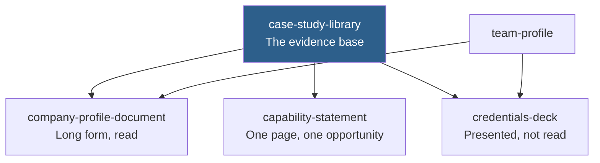

# Company Profile

The documents an organisation uses to establish that it is real, capable, and worth the risk.

## How This Folder Is Organised

[case-study-library.md](case-study-library.md) is the foundation. Every other entry draws on it, and most organisations discover during a bid that their strongest evidence is unusable because nobody ever asked permission to name it.

**Run [case-study-library.md](case-study-library.md) first if you have never run a disclosure campaign.** The gap between "a UK social housing provider" and a named client is the largest credibility difference available to most organisations, and it costs one email per project.

## Index

| Entry | Produces | Read by |
| --- | --- | --- |
| [case-study-library.md](case-study-library.md) | The evidence base, with disclosure permissions recorded | Nobody directly — everything else draws on it |
| [company-profile-document.md](company-profile-document.md) | The long-form profile | Procurement, partners, anyone checking you are real |
| [capability-statement.md](capability-statement.md) | One page answering one buyer's specific question | A buyer with a specific requirement |
| [team-profile.md](team-profile.md) | Named-people biographies as delivery evidence | Anyone assessing delivery risk in a small organisation |
| [credentials-deck.md](credentials-deck.md) | The presented form | A room, plus whoever it is forwarded to |

## The Thread Running Through All Five

**A claim you cannot substantiate on request is an exposure, not an asset.** Every entry here audits claims and cuts what cannot be evidenced rather than softening it into vagueness. A vague claim occupies space and convinces nobody.

The second thread: **name the gap before the reader finds it.** A disqualifier you volunteer and answer is worth more than the same disqualifier discovered at reference stage, where it discredits everything else you said.

## Ownership Boundaries

Per the [folder ownership rules](../../../CONTRIBUTING.md#folder-ownership):

| Concern | Owner |
| --- | --- |
| Slide construction, narrative arc, deck mechanics | [../presentations/](../presentations/) — `credentials-deck.md` covers only what is profile-specific |
| Priced, scoped offers | [../proposal/](../proposal/) |
| Sales narrative and objection handling | [../sales/](../sales/) |
| The same material as a website | [../../web/websites/corporate-website.md](../../web/websites/corporate-website.md) |
| Verifying claims before publication | [../../core/research/fact-checking.md](../../core/research/fact-checking.md) |

## A Note on the Examples

Every example in this folder carries `Provenance: constructed` — inputs and outputs demonstrate the pattern rather than transcribing a real engagement. They share one fictional organisation so the five entries read as a single body of work. See [the provenance rule](../../../CONTRIBUTING.md#example-provenance-is-mandatory).

## Related

- [../README.md](../README.md) — the business domain
- [../../README.md](../../README.md) — the full A–Z entry index
- [../presentations/](../presentations/) — owns every slide-based deliverable
- [../proposal/](../proposal/) — what follows a successful profile
- [../../core/research/fact-checking.md](../../core/research/fact-checking.md) — auditing claims before submission
- [../../../docs/Output-Standards.md](../../../docs/Output-Standards.md#content-standards) — claim substantiation rules

## References

- [Crown Commercial Service supplier guidance](https://www.crowncommercial.gov.uk/suppliers) — how formal procurement assesses suppliers
- [UK Companies House](https://www.gov.uk/government/organisations/companies-house) — verifying registration details
- [UK Information Commissioner's Office](https://ico.org.uk/) — consent for published biographies and case studies
