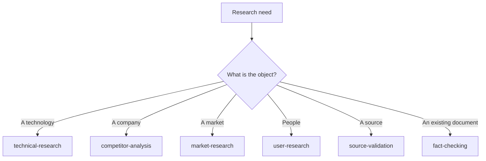

# Research Prompts

Runnable workflows for establishing what is true before you build, decide, or publish.

## Scope of This Folder

The **method** — the source hierarchy, confidence labels, and verification flow — lives in [docs/Research-Framework.md](../../../docs/Research-Framework.md). It is not repeated here.

This folder holds the **workflows that apply that method** to specific research tasks. Read the framework once; use these repeatedly.

> [!NOTE]
> The original design brief listed "Research framework" and "Verification workflow" as entries in this folder. Both are owned by `docs/Research-Framework.md` under the [folder ownership rules](../../../CONTRIBUTING.md#folder-ownership), so they are linked rather than duplicated. Two copies of a sourcing standard drift apart within a release, and then neither can be trusted.

## Index

| Entry | Answers | Typical output |
| --- | --- | --- |
| [technical-research.md](technical-research.md) | "What are the actual capabilities, limits, and trade-offs of X?" | Findings with sources, gaps, and conflicts |
| [competitor-analysis.md](competitor-analysis.md) | "What are they actually doing, and what does it imply for us?" | Evidence-based comparison, not a feature grid |
| [market-research.md](market-research.md) | "Is there demand, who has it, and what do they use now?" | Sized opportunity with stated confidence |
| [user-research.md](user-research.md) | "What do users actually do, as distinct from what they say?" | Behavioural findings separated from reported preferences |
| [source-validation.md](source-validation.md) | "Should I trust this source?" | A trust verdict with the reasoning |
| [fact-checking.md](fact-checking.md) | "Is this document true?" | Per-claim verdicts with citations |

## Choosing an Entry

## The Rule That Governs All of Them

**A stated gap is a finding. An invented fill is a defect.**

Every entry here enforces this. Research that reports "I could not establish X, and here is what would establish it" is more useful than research that quietly interpolated across the gap — because the first tells you exactly what to go and check, and the second gives you no signal that anything is missing.

## Before You Start Any of These

| Check | Why |
| --- | --- |
| Is the question determinate? | "Which queue should we use?" is a decision. "What are the delivery guarantees of X, Y, Z?" is research |
| What decision does it inform? | Sets the precision required. A rough answer suffices for some decisions and is useless for others |
| What counts as authoritative here? | Usually vendor documentation. State it, so the boundary is explicit |
| Is it time-sensitive? | If yes, every finding needs a date |

## Related

- [docs/Research-Framework.md](../../../docs/Research-Framework.md) — the method these workflows apply
- [core/system/research-analyst.md](../system/research-analyst.md) — the role to prepend
- [core/system/output-contract.md](../system/output-contract.md) — the honesty contract
- [core/planning/](../planning/) — turning findings into a plan
- [docs/Thinking-Framework.md](../../../docs/Thinking-Framework.md) — how much research a decision warrants

## References

- [Claude Docs](https://docs.claude.com) — official platform documentation
- [W3C standards](https://www.w3.org/standards/) — primary source for web specifications
- [IETF RFCs](https://www.rfc-editor.org/) — primary source for internet protocols
