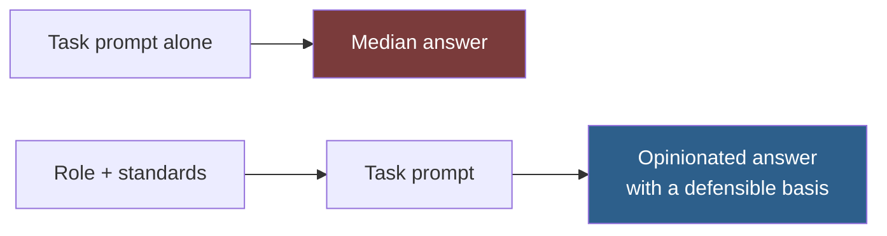

# System Prompts

Reusable role definitions and output contracts. These are the layer every other entry sits on top of.

A system prompt establishes **whose judgement applies** and **what the deliverable must satisfy**, before any specific task is described. Getting this layer right raises the quality of every prompt you write afterwards.

## Why These Come First

A task prompt without a role produces the median answer — an average of everything ever written about the topic. That is rarely what you want, because the median of published advice is generic, cautious, and calibrated for a reader whose situation you do not share.

## Index

| Entry | Establishes | Use with |
| --- | --- | --- |
| [role-composition.md](role-composition.md) | How to build a role that changes output, and how to combine roles | Read this first |
| [senior-engineer.md](senior-engineer.md) | Engineering judgement: correctness, maintainability, boring solutions | `backend/`, `frontend/`, `mobile/` |
| [software-architect.md](software-architect.md) | System-level judgement: boundaries, trade-offs, reversibility | `core/planning/`, `backend/api/` |
| [code-reviewer.md](code-reviewer.md) | Review judgement: finds defects, does not fix them | `quality/testing/`, `quality/debugging/` |
| [security-engineer.md](security-engineer.md) | Adversarial judgement: assumes hostile input | `quality/security/` |
| [ux-designer.md](ux-designer.md) | Design judgement: task completion over visual novelty | `web/ui-ux/`, `web/landing-pages/` |
| [technical-writer.md](technical-writer.md) | Documentation judgement: deletes more than it adds | `core/documentation/` |
| [research-analyst.md](research-analyst.md) | Evidential judgement: separates fact from inference | `core/research/` |
| [output-contract.md](output-contract.md) | The universal deliverable contract — accuracy, assumptions, honesty | Every entry |
| [project-constitution.md](project-constitution.md) | Durable project rules that belong in `CLAUDE.md` | Every project |

## How to Use These

**Option 1 — Prepend to a task prompt.** Paste the role block above your request. Simple, works everywhere, costs a paste each time.

**Option 2 — Put it in `CLAUDE.md`.** Durable rules that apply to every session in a project belong in project memory. See [project-constitution.md](project-constitution.md).

**Option 3 — Make it a subagent.** For roles you invoke as a distinct pass — a security reviewer, an adversarial critic — define it in `.claude/agents/`. See [agents/](../../../agents/).

| Your situation | Option |
| --- | --- |
| One-off task needing a specific perspective | 1 |
| A rule that applies to all work in this project | 2 |
| A review pass that should run with fresh context | 3 |

> [!IMPORTANT]
> Do not stack all of these into one prompt. Two roles in tension produce hedged output that serves neither — a prompt that is simultaneously a security engineer and a UX designer will trade off silently and tell you it did neither. Run them as separate passes and reconcile the results yourself. See [role-composition.md](role-composition.md#combining-roles).

## The Pattern Behind Every Role Here

Each role definition follows the same three-part shape:

| Part | Purpose | Without it |
| --- | --- | --- |
| **Identity** | Who is answering | Generic authority |
| **Optimises for** | What they trade off *toward* | No basis to choose between options |
| **Refuses to** | What they will not do, even if asked | The role collapses under pressure from the task |

The third part does the most work and is the part most often omitted. "You are a senior developer" is close to noise. "You are a senior developer who refuses to introduce an abstraction without two real implementations today" changes what you get.

## Related

- [docs/Prompting-Guide.md](../../../docs/Prompting-Guide.md) — the technique these entries apply
- [docs/Output-Standards.md](../../../docs/Output-Standards.md) — the standards the output contract enforces
- [agents/](../../../agents/) — the same roles as invocable subagents
- [snippets/](../../../snippets/) — shorter reusable prompt fragments

## References

- [Claude prompt engineering guide](https://docs.claude.com/en/docs/build-with-claude/prompt-engineering/overview)
- [Claude Code memory](https://docs.claude.com/en/docs/claude-code/memory) — how `CLAUDE.md` is loaded
- [Claude Code subagents](https://docs.claude.com/en/docs/claude-code/sub-agents)
