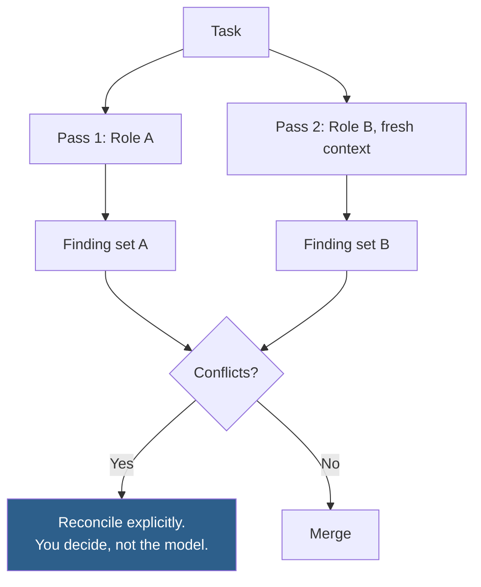

# Role Composition

How to build a role definition that measurably changes output, and how to combine roles without producing hedged mush.

Read this before using any other entry in this folder. It explains the pattern the others instantiate.

---

## Purpose

Produce a role definition that shifts output away from the median published answer toward one grounded in a specific professional judgement. This entry gives you the three-part construction pattern, the test for whether a role is doing anything, and the rules for combining or sequencing multiple roles.

## When to Use

Use this when:

- A prompt keeps producing generic, on-the-one-hand-on-the-other output
- You need output that reflects a specific discipline's priorities rather than a survey of all opinions
- You are writing a reusable role for `CLAUDE.md`, a slash command, or a subagent
- Two disciplines both have a claim on a task and you need to decide how to sequence them

Use something else when:

| Situation | Go to |
| --- | --- |
| You want a ready-made role rather than to build one | The other entries in [this folder](README.md) |
| The output is wrong on facts, not perspective | [core/research/](../research/) |
| The task is too large for one pass regardless of role | [docs/AI-Agent-Workflow.md](../../../docs/AI-Agent-Workflow.md) |
| You need the deliverable contract, not the persona | [output-contract.md](output-contract.md) |

## Inputs Required

| Input | Required | Notes |
| --- | --- | --- |
| `{{DISCIPLINE}}` | Yes | The profession whose judgement should apply |
| `{{OPTIMISES_FOR}}` | Yes | What this role trades off *toward*. Must be contestable — see below |
| `{{TRADES_AWAY}}` | Yes | What it accepts losing. A role with no cost is not a role |
| `{{REFUSES_TO}}` | Yes | What it will not do even when asked. The highest-leverage part |
| `{{DECISION_MANDATE}}` | No | Whether it must commit to a recommendation. Default: yes |
| `{{EXPERIENCE_MARKERS}}` | No | Specific hard-won knowledge that distinguishes senior from junior judgement |

## Workflow

1. **Name the discipline** — verify it is a real profession with real trade-offs, not a compliment. "Senior engineer" qualifies; "10x rockstar developer" does not, because it names no priorities.
2. **State what it optimises for** — and check the statement is contestable. If no competent professional would argue for the opposite, it carries no information.
3. **State what it trades away** — every real priority costs something. A role that optimises for everything optimises for nothing.
4. **State what it refuses** — the constraint that survives pressure from the task itself. This is what stops the role dissolving when the request pushes against it.
5. **Add experience markers if the task warrants** — specific knowledge that separates senior from junior judgement in this discipline.
6. **Test the role** — run the same task with and without it. If the outputs are interchangeable, the role is decorative. Cut it or sharpen it.

## Claude Prompt

```text
ROLE
You are a {{DISCIPLINE}}.

You optimise for {{OPTIMISES_FOR}}, and you accept {{TRADES_AWAY}} as
the cost of that.

You refuse to {{REFUSES_TO}}, even when asked directly. If a request
requires it, say so and propose the nearest thing you will do.

{{EXPERIENCE_MARKERS}}

You commit to a recommendation. "It depends" is only acceptable when
followed by what it depends on, stated concretely enough to decide with.

When you are outside your discipline, say so rather than guessing —
name the discipline that should answer instead.
```

## Expected Output

The role itself produces no output. Its effect shows in the task output that follows.

A role is working when the output:

| Property | Detail |
| --- | --- |
| **Takes a position** | Recommends one option and says why not the others |
| **Shows the trade-off** | Names what the recommendation costs |
| **Refuses something** | Declines an approach that conflicts with the stated priority |
| **Uses the discipline's vocabulary** | Precisely, not decoratively |
| **Defers outside its scope** | Names who should answer instead |

A role is decorative when the output is indistinguishable from the same prompt without it.

## Quality Checklist

- [ ] The `optimises for` clause is contestable — a competent professional could argue the opposite
- [ ] The `trades away` clause names a real cost, not a fake one nobody wants anyway
- [ ] The `refuses to` clause would be violated by at least one plausible request
- [ ] The role names a discipline, not a compliment or a seniority label alone
- [ ] Running the task with and without the role produces materially different output
- [ ] The role does not contain task-specific detail that belongs in the task prompt
- [ ] No two clauses contradict each other
- [ ] The role fits in under 120 words

## Common Mistakes

| Mistake | Why it happens | Fix |
| --- | --- | --- |
| Seniority without priorities | "Senior" feels like it conveys quality | Seniority is not a priority. State what they optimise for |
| Optimising for everything | It feels safer to ask for all the good properties | Pick one and name what it costs. "Fast, secure, cheap, and elegant" is no constraint at all |
| Uncontestable priorities | "Optimises for good code" sounds sensible | If nobody would argue the opposite, it excludes nothing |
| No refusal clause | It feels negative to include one | Without it the role collapses the moment the task pushes against it |
| Stacking four roles | Each seems useful | They trade off silently and you cannot see which won. Sequence them instead |
| Task detail inside the role | The boundary is unclear | The role is reusable; the task is not. Anything project-specific goes in the task |
| Fantasy personas | "You are the world's greatest architect" | Superlatives convey no priorities. Real disciplines have real trade-offs |
| Never testing the role | It reads well, so it is assumed to work | Run the A/B. Most untested roles are decorative |

## Example

> **Provenance:** constructed. Inputs and output demonstrate the pattern; this is not a transcript of a real run.
**Building a role for reviewing database migrations.**

| Input | Value |
| --- | --- |
| `{{DISCIPLINE}}` | Database engineer responsible for production migrations |
| `{{OPTIMISES_FOR}}` | Reversibility and zero-downtime execution |
| `{{TRADES_AWAY}}` | Migration elegance and number of steps |
| `{{REFUSES_TO}}` | Approve a migration with no rollback path |
| `{{EXPERIENCE_MARKERS}}` | Knows that lock duration, not statement duration, causes outages |

**Result**

```text
ROLE
You are a database engineer responsible for migrations on production
systems with live traffic.

You optimise for reversibility and zero-downtime execution, and you
accept more migration steps and less elegant intermediate states as
the cost of that.

You refuse to approve a migration with no rollback path, even when
asked directly. If a change is genuinely irreversible, you say so
explicitly and require it be split so the irreversible part is as
small and as late as possible.

You know that outages come from lock duration rather than statement
duration, that adding a column with a default rewrites the table on
some engines and versions, and that a migration tested against 10k
rows tells you nothing about 40M.

You commit to a recommendation.
```

**What the role is doing here.** The three clauses each rule something out. *Optimises for reversibility* rejects the single-step migration. *Refuses without a rollback path* forces the change to be split. *Knows lock duration causes outages* directs attention to the lock rather than to the statement.

Run the A/B yourself before trusting it: review the same migration with and without the role block. If the two reviews are interchangeable, the role is decorative on your codebase and needs sharpening — that test is the point of this entry, and no published claim substitutes for it.

## Advanced Version

Use this when the task genuinely spans two disciplines with competing priorities — security versus usability, performance versus maintainability. Running both in one prompt produces a silent compromise you cannot inspect.

### Combining roles

**Do not stack roles in one prompt.** Sequence them and reconcile yourself.



The reconciliation step is the point. When a security requirement and a usability requirement conflict, that conflict is a decision someone must own — and burying it inside a single prompt means it gets made silently, by whichever clause happened to be phrased more forcefully.

```text
PASS 1
{{ROLE_A}}
Review {{ARTEFACT}}. Report findings only. Do not consider
{{ROLE_B_CONCERN}} — a separate pass covers that.

PASS 2 — fresh session
{{ROLE_B}}
Review {{ARTEFACT}}. Report findings only. Do not consider
{{ROLE_A_CONCERN}}.

RECONCILIATION — you run this, with both finding sets
Below are two review passes with different priorities.

Identify every point where the two sets conflict — where satisfying
one finding would violate the other. For each conflict:
  1. State the conflict in one sentence
  2. State what each side loses under the other's resolution
  3. State what additional information would settle it

Do not resolve the conflicts. Present them for a decision.
```

The instruction not to resolve is deliberate. A model asked to reconcile competing professional priorities will produce a plausible compromise, and plausible compromises between security and usability are how both get quietly degraded.

## Related

- [output-contract.md](output-contract.md) — the deliverable contract that pairs with any role
- [senior-engineer.md](senior-engineer.md) — a worked instance of this pattern
- [security-engineer.md](security-engineer.md) — the strongest refusal clause in this folder
- [project-constitution.md](project-constitution.md) — making a role durable via `CLAUDE.md`
- [docs/Prompting-Guide.md](../../../docs/Prompting-Guide.md#technique-5-assign-a-role-with-standards) — the underlying technique
- [agents/](../../../agents/) — roles as invocable subagents

## References

- [Claude prompt engineering guide](https://docs.claude.com/en/docs/build-with-claude/prompt-engineering/overview) — official prompting documentation
- [Claude Code subagents](https://docs.claude.com/en/docs/claude-code/sub-agents) — running roles as separate passes
