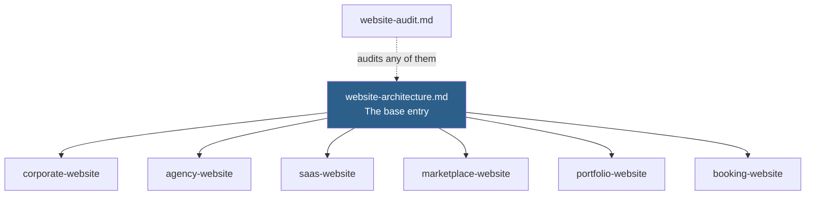

# Website Prompts

Entries for designing and building multi-page websites, organised by **archetype** — the structural pattern that determines information architecture and conversion model.

## How This Folder Is Organised

One base entry carries the depth. Archetypes carry only what differs.



**Always start with [website-architecture.md](website-architecture.md).** It establishes the page inventory, the conversion model, and the content structure. The archetype entries assume you have run it and cover only the decisions specific to their pattern.

This is deliberate. Six archetype entries each restating information architecture would be six copies that drift apart, and then nobody knows which one is current.

## Index

| Entry | Archetype | Defining characteristic |
| --- | --- | --- |
| [website-architecture.md](website-architecture.md) | — | **Run first.** IA, page inventory, conversion model, content model |
| [corporate-website.md](corporate-website.md) | Corporate | Many audiences, trust is the product, procurement-driven |
| [agency-website.md](agency-website.md) | Agency | Work is the proof; the site is a portfolio with a sales layer |
| [saas-website.md](saas-website.md) | SaaS | Self-serve conversion; the product does the selling |
| [marketplace-website.md](marketplace-website.md) | Marketplace | Two audiences with opposite needs on the same site |
| [portfolio-website.md](portfolio-website.md) | Portfolio | One person, one story, tight scope |
| [booking-website.md](booking-website.md) | Booking | Availability and reservation are the core interaction |
| [website-audit.md](website-audit.md) | — | Assessing an existing site before changing it |

## Where the Other Prompts Went

The original design brief listed 19 website prompts. Several were not archetypes — they were channels, applications, or industry variants. Building them all here would have produced sixteen near-identical files.

| Original brief item | Now lives at | Why |
| --- | --- | --- |
| Corporate Website | [corporate-website.md](corporate-website.md) | Archetype |
| Agency Website | [agency-website.md](agency-website.md) | Archetype |
| SaaS | [saas-website.md](saas-website.md) | Archetype |
| Marketplace | [marketplace-website.md](marketplace-website.md) | Archetype |
| Portfolio | [portfolio-website.md](portfolio-website.md) | Archetype |
| Hotel | [booking-website.md](booking-website.md) | Same reservation model as Restaurant |
| Restaurant | [booking-website.md](booking-website.md) | Same reservation model as Hotel |
| **Landing Page** | [../landing-pages/](../landing-pages/) | A single-goal conversion page is not a website. Different structure, different measurement |
| **Dashboard** | [../dashboards/](../dashboards/) | An internal data interface, not a marketing surface |
| **Admin Panel** | [../dashboards/](../dashboards/) | Same as dashboard |
| **CRM** | [../dashboards/](../dashboards/) | An application, not a website |
| **ERP** | [../dashboards/](../dashboards/) | An application, not a website |
| **Healthcare** | [../../industries/](../../industries/) | A constraint overlay on an archetype, not an archetype |
| **Education** | [../../industries/](../../industries/) | Same |
| **Government** | [../../industries/](../../industries/) | Same |
| **NGO** | [../../industries/](../../industries/) | Same |
| **Real Estate** | [../../industries/](../../industries/) | Same |
| **Manufacturing** | [../../industries/](../../industries/) | Same |
| **Logistics** | [../../industries/](../../industries/) | Same |

### Why industries are overlays, not archetypes

A healthcare corporate site and a manufacturing corporate site share their entire information architecture. What differs is the **constraints**: regulated claims, consent language, accessibility obligations, procurement cycles, and vocabulary.

Encoding that as two separate full entries means every future improvement to corporate site structure has to be made twice, and will not be. Encoding it as an overlay means the archetype improves once and every industry inherits it.

```text
Base archetype  →  Industry overlay  →  Your site
corporate-website  +  healthcare       =  regulated claims, consent,
                                          WCAG obligations, clinical accuracy
```

> [!IMPORTANT]
> If you are building a healthcare website, you run **two** entries: the archetype for structure, then the industry overlay for constraints. Not one combined entry. The overlay is where the things that get you in trouble live.

## Shared Concerns Live Elsewhere

Per the [folder ownership rules](../../../CONTRIBUTING.md#folder-ownership), these are not restated here:

| Concern | Owner |
| --- | --- |
| Visual and interaction design | [../ui-ux/](../ui-ux/) |
| Accessibility conformance | [../../quality/accessibility/](../../quality/accessibility/) |
| Performance budgets and Core Web Vitals | [../../quality/performance/](../../quality/performance/) |
| Security | [../../quality/security/](../../quality/security/) |
| Search optimisation | [../../growth/seo/](../../growth/seo/) |
| AI answer engine optimisation | [../../growth/geo/](../../growth/geo/) |
| Written content | [../../growth/blogs/](../../growth/blogs/) |
| Image sourcing and licensing | [../../../assets/](../../../assets/) |

Every entry in this folder links to these rather than repeating them. Accessibility rules restated across eight archetype files would be out of sync by the next release.

## Before You Start Any Entry Here

| Check | Why |
| --- | --- |
| Do you know the primary conversion? | A site without one defined becomes a brochure that measures nothing |
| Do you have real content, or an estimate of its length? | Layouts designed against lorem ipsum break on real content |
| Who decides? | Sites die in review when the decision-maker was not identified at the start |
| What is the maintenance model? | A site nobody can update is a site that is wrong within a year |

## Related

- [../landing-pages/](../landing-pages/) — single-goal conversion pages
- [../dashboards/](../dashboards/) — internal applications, admin panels, CRM, ERP
- [../ui-ux/](../ui-ux/) — visual and interaction design
- [../../industries/](../../industries/) — vertical constraint overlays
- [../../../docs/Output-Standards.md](../../../docs/Output-Standards.md) — the quality bar every entry enforces
- [../../core/system/ux-designer.md](../../core/system/ux-designer.md) — the role to prepend

## References

- [WCAG 2.2](https://www.w3.org/TR/WCAG22/) — accessibility conformance
- [Core Web Vitals](https://web.dev/articles/vitals) — performance metrics
- [Schema.org](https://schema.org/) — structured data vocabulary
